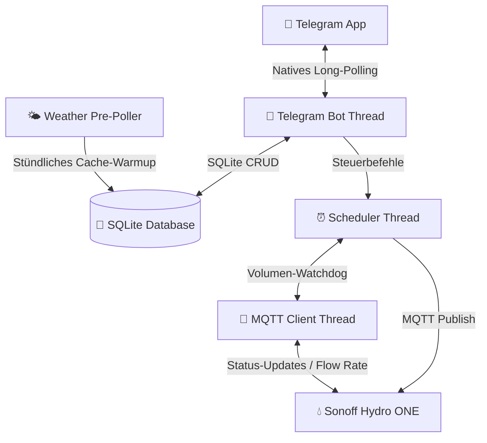

# 💧 Smart Garden Irrigation Daemon (Gartenbewässerungs-Steuerung)

Ein extrem leichtgewichtiger, offline-fähiger und hochsicherer Hintergrunddienst (Daemon) für den **Raspberry Pi Zero W** zur intelligenten Steuerung eines **Sonoff Hydro ONE (Zigbee 3.0)** Wasserventils. 

Die Steuerung erfolgt weltweit gesichert über einen whitelist-basierten **Telegram-Bot** per Long-Polling, wodurch **keine offenen Ports** (Portweiterleitung/NAT-Traversal) an Ihrem Router benötigt werden.

---

## ✨ Hauptmerkmale

*   **🟢 Kombinierter Guss (First-to-Hit Limit):** Ultimativer Überflutungsschutz. Jeder Bewässerungslauf (sowohl manuell als auch geplant) überwacht *parallel* ein **Zeitlimit** (Minuten) und ein **Volumenlimit** (Liter). Das Ventil schließt automatisch, sobald der *erste* Grenzwert erreicht wird (z. B. 50 Liter fließen ODER 15 Minuten verstreichen).
*   **📅 Geführter Zeitplan-Assistent (Guided Wizard):** Erstellen Sie komplexe Zeitpläne Schritt-für-Schritt direkt im Telegram-Chat über intuitive Inline-Tastaturen (freie Namenseingabe, Stundenraster, 5-Minuten-Schritte, Kleingarten-Presets und Multi-Select-Wochentage).
*   **🛢️ Füllstandsauswertung & Alarmierung:** Der Daemon empfängt Messwerte des Füllstandssensors (Abstand in cm) per MQTT, berechnet den prozentualen Füllstand der Klärgrube und speichert ihn in SQLite. Bei erstmaliger Überschreitung eines Schwellenwerts (z. B. 80 %) erfolgt ein Sofort-Alarm via Telegram. Der Füllstand wird in den täglichen Statusbericht integriert.
*   **🐕 Inaktivitäts-Watchdog:** Sicherheitsüberwachung für den Batterie-Füllstandssensor. Bleibt eine Füllstands-Meldung für mehr als 18 Stunden aus, warnt der Bot proaktiv vor einem Sensor- oder Batterieausfall.
*   **🌦️ Intelligenter Wetter-Skip (Offline-first):** Open-Meteo API-Anbindung prüft stündlich im Hintergrund den Regen (letzte 24h Historie + nächste 24h Vorhersage). Überschreitet die Summe Ihren Grenzwert (z. B. 3.0 mm), wird die geplante Bewässerung übersprungen und protokolliert. Durch lokale SQLite-Zwischenspeicherung funktioniert dies auch bei temporärem Internetausfall.
*   **🔌 Live-Verbindungsanzeige:** Der Status-Bildschirm (`/status`) visualisiert in Echtzeit, ob die MQTT-Brokerverbindung steht (Erkennung von fehlenden USB-Dongles) und wann das physische Ventil das letzte Mal ein Lebenszeichen gesendet hat.
*   **⚡ 100 % Abhängigkeitsfrei (Telegram & API):** Entwickelt komplett auf Basis der Python-Standardbibliotheken (`urllib.request`). Keine schweren Frameworks – perfekt optimiert für den ressourcenschwachen Single-Core-Prozessor des Pi Zero W.

---

## 🛠️ Systemarchitektur & Ablauf

Das System arbeitet vollkommen lokal auf Ihrem Raspberry Pi Zero W:



---

## 📂 Verzeichnisstruktur

```text
/
├── CONTEXT.md               # Projektspezifische Ubiquitous Language (Glossar)
├── README.md                # Diese Dokumentation
├── deploy.ps1               # PowerShell Bereitstellungsskript für Windows
├── setup.sh                 # Vollautomatisches Pi-Installationsskript (alle Dienste)
├── garden.db                # Lokale SQLite-Datenbank
├── zeitsteuerung_guide.md   # Detaillierter Leitfaden zur Zeitsteuerung
├── docs/
│   └── adr/                 # Architekturentscheidungen (ADRs 0001 - 0008)
├── src/
│   └── daemon/
│       ├── config.py        # Konfigurations- und .env-Loader
│       ├── database.py      # Datenbank-Schnittstelle & automatische Migrationen
│       ├── weather.py       # Wetterdatenabfrage & Skip-Logik
│       ├── mqtt_client.py   # Asynchrone Zigbee2MQTT-Schnittstelle mit Durchfluss-Simulator
│       ├── scheduler.py     # Guss-Zeitsteuerung & parallele Wächter-Threads
│       ├── telegram_bot.py  # Dialogführung, Assistenten & Statusvisualisierung
│       └── main.py          # Zentraler Programmeinstieg
└── tests/
    └── test_irrigation.py   # Unit- & Integrationstests (Offline-Simulationsmodus)
```

---

## 🚀 Installation & Bereitstellung auf dem Pi Zero W

### Voraussetzungen

#### 1. Hardware
*   **Steuerzentrale**: Raspberry Pi Zero W (oder neuer)
*   **Funk-Koordinator**: Sonoff Zigbee 3.0 USB Dongle Plus (am Pi eingesteckt)
*   **Ventil**: Sonoff Hydro ONE Smart-Wasserlaufventil (griffbereit für die Kopplung)

#### 2. System- & Software-Bibliotheken (auf dem Raspberry Pi)
Das automatische Installationsskript `setup.sh` richtet diese Versionen und Pakete selbstständig ein:

| Komponente / Bibliothek | Benötigte Version | Installationsquelle | Zweck |
|---|---|---|---|
| **Python** | `>= 3.9` | Vorinstalliert im OS | Ausführung des Bewässerungs-Daemons |
| **paho-mqtt** | `python3-paho-mqtt` (`~1.6`) | `apt` Paket | MQTT-Kommunikation in Python |
| **Mosquitto** | `mosquitto` & `mosquitto-clients` | `apt` Paket | Lokaler MQTT-Message-Broker |
| **Node.js** | `>= v20.10.0` (installiert wird `v20.11.1`) | Inoffizieller ARMv6-Build | Laufzeitumgebung für Zigbee2MQTT |
| **Zigbee2MQTT** | `v2.10.1` | Git / lokaler Build | Mittelweg-Dienst für Zigbee-Kommunikation |
| **System-Tools** | `git`, `curl` | `apt` Paket | Git-Repository und Download-Utilities |

> [!IMPORTANT]
> **Wichtiger Hinweis zum Firmware-Upgrade des Funk-Koordinators (ZBDongle-E / EZSP v8 -> v13+):**
> Wenn Sie die Firmware des Dongles auf Version `v7.4` (oder neuer) aktualisieren, müssen Sie unbedingt folgenden Migrations-Workflow einhalten, da andernfalls das Backup-File beschädigt wird und Sie Ihr gesamtes Zigbee-Netzwerk neu anlernen müssen:
> 1. Konfigurieren Sie Zigbee2MQTT beim ersten Start nach dem Upgrade zwingend mit `adapter: ezsp` in der `configuration.yaml` (NICHT direkt mit `adapter: ember` starten!).
> 2. Lassen Sie Zigbee2MQTT einmal vollständig mit `ezsp` starten, um die interne Backup-Datei erfolgreich auf das neue Format zu migrieren.
> 3. Ändern Sie erst danach den Wert in der `configuration.yaml` auf `adapter: ember` (bzw. entfernen Sie den Eintrag, da `ember` der Standardwert ist).

#### 3. Konfigurationsdatei
Erstelle eine `.env`-Datei aus der Vorlage `.env.template` im Projektverzeichnis:
   ```bash
   cp .env.template .env
   nano .env
   ```
   ```ini
   TELEGRAM_BOT_TOKEN="DEIN_BOT_TOKEN_VOM_BOTFATHER"
   TELEGRAM_ALLOWED_USER_IDS="DEINE_TELEGRAM_USER_ID"
   LATITUDE=52.502778
   LONGITUDE=13.515556
   RAIN_THRESHOLD_MM=3.0
   ```

### 1. Projektdateien übertragen (Windows → Pi)
```powershell
.\deploy.ps1
```
*IP-Adresse und SSH-Benutzernamen des Pi eingeben, wenn gefragt.*

### 2. Vollautomatisches Setup auf dem Pi starten
```bash
ssh <user>@<pi-ip>
cd ~/garden && bash setup.sh
```

Das Skript richtet **alle drei Systemdienste** vollautomatisch ein:

| Dienst | Beschreibung |
|---|---|
| `mosquitto` | MQTT-Broker |
| `zigbee2mqtt` | Mittelweg-Dienst (Funk-Koordinator → MQTT) |
| `garden-irrigation` | Bewässerungs-Daemon |

Die Startreihenfolge beim Booten ist: **Mosquitto → Zigbee2MQTT → Bewässerungs-Daemon**

> **Während des Setups:** Das Skript fordert dich auf, den **Reset-Knopf am Sonoff Hydro ONE 5 Sekunden** zu halten. Das Ventil wird danach automatisch erkannt, auf den Namen `garden_valve` konfiguriert und die Kopplung abgeschlossen.

### 3. Ergebnis prüfen
```bash
sudo systemctl status mosquitto zigbee2mqtt garden-irrigation
```
Oder einfach den Telegram-Bot öffnen und `/status` senden.

---

## 🤖 Bedienung über den Telegram-Bot

Der Bot bietet ein permanentes Tastenmenü am unteren Bildschirmrand:

*   **📊 Status anzeigen (`/status`):** Liefert ein detailliertes Dashboard mit MQTT-Brokerstatus, Ventil-Online-Zustand, Füllstand, Wetterkonditionen (inkl. Temperatur & Datenstand) und dem Verlauf der letzten Zyklen.
*   **🛢️ Füllstand Grube (`/fuellstand`):** Zeigt den aktuellen Pegel der Klärgrube als visuellen Ladebalken, den 24-Stunden-Trend, das Datum der letzten Aktualisierung sowie die Batteriespannung des Füllstandssensors.
*   **📅 Zeitsteuerung (`/zeitplan`):** Listet alle aktiven Zeitpläne auf und bietet die Schaltfläche **`➕ Neuer Zeitplan`**, um den geführten Assistenten zu starten.
*   **🟢 Bewässern starten:** Startet den zweistufigen manuellen Guss-Assistenten zur bequemen Festlegung von Zeitlimit (Minuten) und Volumenlimit (Liter).
*   **🔴 Sofort Stopp (`/stop`):** Schließt das Ventil unverzüglich und bricht alle aktiven Scheduler- und Volumenwächter-Threads ab.


---

## 🧪 Entwickler & Test-Guide

Sie können das gesamte System lokal (z. B. unter Windows) testen, ohne dass ein physischer USB-Stick oder ein MQTT-Broker angeschlossen sein muss. Der Client wechselt automatisch in einen **Simulationsmodus (Mock-Client)**, falls `paho-mqtt` fehlt oder im Testsuite-Setup `HAS_PAHO = False` gesetzt wird. In diesem Modus wird ein konstanter Wasserdurchfluss von 5 L/Min im Hintergrund simuliert.

**Ausführen der Testsuite:**
```bash
python -m unittest tests/test_irrigation.py
```
*(Die Tests decken Datenbank-CRUD, Migrationslogik, Wetter-Skips, Simulator-Status und die First-to-Hit-Abschaltung ab).*
