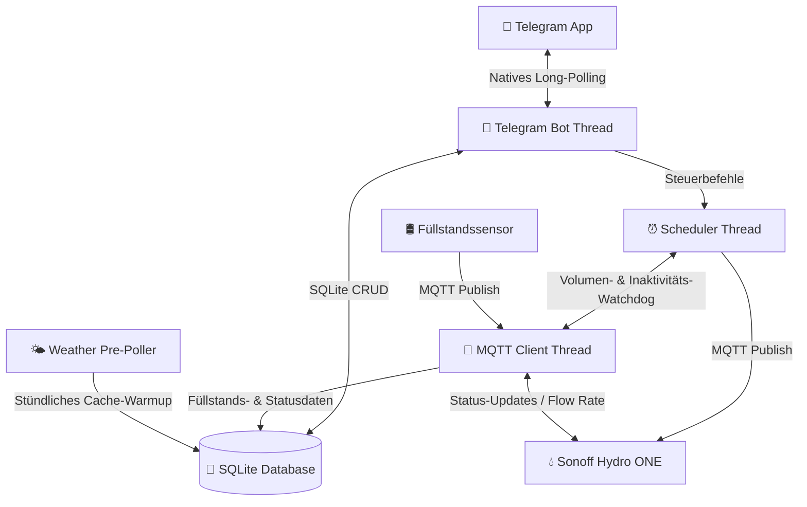

# 💧 Smart Garden Irrigation Daemon (Gartenbewässerungs-Steuerung)

Ein extrem leichtgewichtiger, offline-fähiger und hochsicherer Hintergrunddienst (Daemon) für den **Raspberry Pi Zero W** zur intelligenten Steuerung eines **Sonoff Hydro ONE (Zigbee 3.0)** Wasserventils. 

Die Steuerung erfolgt weltweit gesichert über einen whitelist-basierten **Telegram-Bot** per Long-Polling, wodurch **keine offenen Ports** (Portweiterleitung/NAT-Traversal) an Ihrem Router benötigt werden.

---

## ✨ Hauptmerkmale

*   **🟢 Kombinierter Guss (First-to-Hit Limit):** Ultimativer Überflutungsschutz. Jeder Bewässerungslauf (sowohl manuell als auch geplant) überwacht *parallel* ein **Zeitlimit** (Minuten) und ein **Volumenlimit** (Liter). Das Ventil schließt automatisch, sobald der *erste* Grenzwert erreicht wird (z. B. 50 Liter fließen ODER 15 Minuten verstreichen).
*   **📡 Mehrfach-Ventil-Unterstützung:** Koppeln und benennen Sie beliebig viele Sonoff Hydro ONE Ventile über den Telegram-Bot (`🔧 Ventil koppeln`). Zeitpläne können mehrere Ventile **sequentiell** (nacheinander, druckschonend) oder **parallel** (gleichzeitig, jedes mit eigenem Grenzwert) steuern. Live-Status und Tagesbericht zeigen Batterie, Signalstärke und letztes Lebenszeichen pro Ventil separat an.
*   **📅 Geführter Zeitplan-Assistent (Guided Wizard):** Erstellen Sie komplexe Zeitpläne Schritt-für-Schritt direkt im Telegram-Chat über intuitive Inline-Tastaturen (freie Namenseingabe, Stundenraster, 5-Minuten-Schritte, Kleingarten-Presets und Multi-Select-Wochentage).
*   **🛢️ Füllstandsauswertung & Alarmierung (Geplant):** Der Daemon empfängt Messwerte des Füllstandssensors (Abstand in cm) per MQTT, berechnet den prozentualen Füllstand der Klärgrube und speichert ihn in SQLite. Bei erstmaliger Überschreitung eines Schwellenwerts (z. B. 80 %) erfolgt ein Sofort-Alarm via Telegram. Der Füllstand wird in den täglichen Statusbericht integriert.
*   **🐕 Inaktivitäts-Watchdog:** Proaktive Überwachung von batteriebetriebenen Geräten. Bleibt eine Füllstands-Meldung des Füllstandssensors (z. B. > 18 Stunden, sobald integriert) oder ein Lebenszeichen eines Ventils (z. B. > 24 Stunden) aus, warnt der Bot sofort vor einem Verbindungs- oder Batterieausfall.
*   **🌦️ Intelligenter Wetter-Skip (Offline-first):** Open-Meteo API-Anbindung prüft stündlich im Hintergrund den Regen (letzte 24h Historie + nächste 24h Vorhersage). Überschreitet die Summe Ihren Grenzwert (z. B. 3.0 mm), wird die geplante Bewässerung übersprungen und protokolliert. Durch lokale SQLite-Zwischenspeicherung funktioniert dies auch bei temporärem Internetausfall.
*   **🔌 Live-Verbindungsanzeige:** Der Status-Bildschirm (`/status`) visualisiert in Echtzeit, ob die MQTT-Brokerverbindung steht und zeigt für jedes registrierte Ventil separat: Verbindungsstatus, Batteriestand und Signalqualität.
*   **⚡ 100 % Abhängigkeitsfrei (Telegram & API):** Entwickelt komplett auf Basis der Python-Standardbibliotheken (`urllib.request`). Keine schweren Frameworks – perfekt optimiert für den ressourcenschwachen Single-Core-Prozessor der Steuerzentrale (Pi Zero W).

---

## 🛠️ Systemarchitektur & Ablauf

Das System arbeitet vollkommen lokal auf Ihrer Steuerzentrale (Raspberry Pi Zero W):



---

## 📂 Verzeichnisstruktur

```text
/
├── CONTEXT.md               # Projektspezifische Ubiquitous Language (Glossar)
├── ARCHITECTURE.md          # Architekturregeln (Hexagonal Architecture, EventBus)
├── README.md                # Diese Dokumentation
├── deploy.ps1               # PowerShell Bereitstellungsskript für Windows
├── setup.sh                 # Vollautomatisches Installationsskript für die Steuerzentrale (alle Dienste)
├── garden.db                # Lokale SQLite-Datenbank (Zeitpläne, Ventile, Verlauf)
├── docs/
│   ├── adr/                 # Architekturentscheidungen (ADRs 0001–0023)
│   ├── features/            # Feature-Spezifikationen
│   ├── hardware/            # Pläne zur Geräteverkabelung
│   └── plans/               # Detaillierte Umsetzungspläne (completed/ für abgeschlossene)
├── src/
│   └── daemon/
│       ├── config.py        # Konfigurations- und .env-Loader
│       ├── scheduler.py     # Zeitsteuerung & sequentielle/parallele Ventil-Queue
│       ├── main.py          # Zentraler Programmeinstieg & IoC-Verdrahtung
│       ├── core/            # Domänenlogik (kein I/O)
│       │   ├── event_bus.py             # Thread-sicherer synchroner Ereignis-Kanal
│       │   ├── watering_controller.py   # Guss-Steuerung mit Multi-Ventil-Support
│       │   ├── scheduler_events.py      # Domänen-Ereignistypen (Zeitsteuerung, Reports)
│       │   ├── valve_events.py          # Ventil-Ereignistypen (Kopplung, Status)
│       │   ├── watchdog_events.py       # Inaktivitäts-Ereignistypen
│       │   └── weather_codes.py         # WMO-Wettercode-Definitionen
│       ├── adapters/        # Äußere Grenze — kein Cross-Adapter-Import
│       │   ├── database.py              # SQLite CRUD (Zeitpläne, Ventile, Verlauf)
│       │   ├── database_adapter.py      # Domänen-Events → Datenbank-Archivierung
│       │   ├── mqtt_client.py           # MQTT-Schnittstelle + Simulations-Adapter
│       │   ├── weather.py               # Open-Meteo HTTP-Adapter & Skip-Logik
│       │   ├── daily_report.py          # Täglicher Statusbericht (pro Ventil)
│       │   ├── watchdog.py              # Überwachung inaktiver Ventile
│       │   ├── chart.py                 # Generierung des grafischen Wettercharts
│       │   └── pairing.py               # Ventil-Kopplung (Zigbee-Join + DB-Registrierung)
│       └── ui/              # Benutzeroberfläche (Telegram)
│           ├── telegram_bot.py          # Bot-Hauptschleife & Event-Dispatcher
│           ├── telegram_client.py       # Raw HTTP Telegram API (nur Stdlib)
│           └── telegram_ui.py           # Bot-Handler, Wizards & Benachrichtigungen
├── vendor/
│   └── zigbee2mqtt/         # Lokale, modifizierte Zigbee2MQTT-Quellen (Mittelweg-Dienst)
└── tests/
    ├── test_irrigation.py   # Integrationstests (Offline-Simulationsmodus)
    ├── core/                # Unit-Tests für Domänen-Kern
    └── adapters/            # Unit-Tests für Adapter (Datenbank, MQTT, Pairing)
```

---

## 🚀 Installation & Bereitstellung auf der Steuerzentrale

### Voraussetzungen

#### 1. Hardware
*   **Steuerzentrale**: Raspberry Pi Zero W (oder neuer)
*   **Funk-Koordinator**: Sonoff Zigbee 3.0 USB Dongle Plus (an der Steuerzentrale eingesteckt)
*   **Ventil**: Sonoff Hydro ONE Smart-Wasserlaufventil (griffbereit für die Kopplung)

#### 2. System- & Software-Bibliotheken (auf der Steuerzentrale)
Das automatische Installationsskript `setup.sh` richtet diese Versionen und Pakete selbstständig ein:

| Komponente / Bibliothek | Benötigte Version | Installationsquelle | Zweck |
|---|---|---|---|
| **Python** | `>= 3.9` | Vorinstalliert im OS | Ausführung des Bewässerungs-Daemons |
| **paho-mqtt** | `python3-paho-mqtt` (`~1.6`) | `apt` Paket | MQTT-Kommunikation in Python |
| **Mosquitto** | `mosquitto` & `mosquitto-clients` | `apt` Paket | Lokaler MQTT-Message-Broker |
| **Node.js** | `>= v20.10.0` (installiert wird `v20.11.1`) | Inoffizieller ARMv6-Build | Laufzeitumgebung für Zigbee2MQTT |
| **Zigbee2MQTT** | `v2.10.1` | Git / lokaler Build | Mittelweg-Dienst für Zigbee-Kommunikation |
| **System-Tools** | `git`, `curl` | `apt` Paket | Git-Repository und Download-Utilities |

> [!IMPORTANT]
> **Wichtiger Hinweis zum Firmware-Upgrade des Funk-Koordinators (ZBDongle-E / EZSP v8 -> v13+):**
> Wenn Sie die Firmware des Dongles auf Version `v7.4` (oder neuer) aktualisieren, müssen Sie unbedingt folgenden Migrations-Workflow einhalten, da andernfalls das Backup-File beschädigt wird und Sie Ihr gesamtes Zigbee-Netzwerk neu anlernen müssen:
> 1. Konfigurieren Sie Zigbee2MQTT beim ersten Start nach dem Upgrade zwingend mit `adapter: ezsp` in der `configuration.yaml` (NICHT direkt mit `adapter: ember` starten!).
> 2. Lassen Sie Zigbee2MQTT einmal vollständig mit `ezsp` starten, um die interne Backup-Datei erfolgreich auf das neue Format zu migrieren.
> 3. Ändern Sie erst danach den Wert in der `configuration.yaml` auf `adapter: ember` (bzw. entfernen Sie den Eintrag, da `ember` der Standardwert ist).

#### 3. Konfigurationsdatei
Erstelle eine `.env`-Datei aus der Vorlage `.env.template` im Projektverzeichnis:
   ```bash
   cp .env.template .env
   nano .env
   ```
   ```ini
   TELEGRAM_BOT_TOKEN="DEIN_BOT_TOKEN_VOM_BOTFATHER"
   TELEGRAM_ALLOWED_USER_IDS="DEINE_TELEGRAM_USER_ID"
   LATITUDE=0.0
   LONGITUDE=0.0
   RAIN_THRESHOLD_MM=3.0
   ```

### 1. Projektdateien übertragen (Windows → Steuerzentrale)
```powershell
.\deploy.ps1
```
*IP-Adresse und SSH-Benutzernamen der Steuerzentrale eingeben, wenn gefragt.*

### 2. Vollautomatisches Setup auf der Steuerzentrale starten
```bash
ssh <user>@<pi-ip>
cd ~/garden && bash setup.sh
```

Das Skript richtet **alle drei Systemdienste** vollautomatisch ein:

| Dienst | Beschreibung |
|---|---|
| `mosquitto` | MQTT-Broker |
| `zigbee2mqtt` | Mittelweg-Dienst (Funk-Koordinator → MQTT) |
| `garden-irrigation` | Bewässerungs-Daemon |

Die Startreihenfolge beim Booten ist: **Mosquitto → Zigbee2MQTT → Bewässerungs-Daemon**

> **Während des Setups:** Das Skript richtet das System ein, aber das erste Ventil wird erst über den Telegram-Bot gekoppelt. Drücke nach dem Start des Daemons **`🔧 Ventil koppeln`** im Bot, vergib einen Wunschnamen (z. B. „Garten"), halte dann den **Reset-Knopf am Sonoff Hydro ONE 5 Sekunden**. Das Ventil wird automatisch erkannt, erhält eine eindeutige System-ID und wird in der Datenbank registriert.

### 3. Ergebnis prüfen
```bash
sudo systemctl status mosquitto zigbee2mqtt garden-irrigation
```
Oder einfach den Telegram-Bot öffnen und `/status` senden.

---

## 🤖 Bedienung über den Telegram-Bot

Der Bot bietet ein permanentes Tastenmenü am unteren Bildschirmrand:

*   **📊 Status anzeigen (`/status`):** Liefert ein detailliertes Dashboard mit MQTT-Brokerstatus, dem Zustand aller registrierten Ventile (Verbindung, Batterie, Signalstärke), aktuellen Wetterdaten und dem Verlauf der letzten Zyklen.
*   **📅 Zeitsteuerung (`/zeitplan`):** Listet alle aktiven Zeitpläne auf und bietet die Schaltfläche **`➕ Neuer Zeitplan`**, um den geführten Assistenten zu starten.
*   **🟢 Bewässern starten:** Startet den zweistufigen manuellen Guss-Assistenten zur bequemen Festlegung von Zeitlimit (Minuten) und Volumenlimit (Liter).
*   **🔴 Sofort Stopp (`/stop`):** Schließt alle aktiven Ventile unverzüglich und bricht alle Scheduler-Threads ab.
*   **🔧 Ventil koppeln (`/setup`):** Immer sichtbar — startet den Kopplungs-Assistenten. Der Bot fragt zunächst nach einem **Wunschnamen** (z. B. „Terrasse"), dann wird der Reset-Knopf am Sonoff Hydro ONE gedrückt. Das Ventil erhält automatisch eine eindeutige System-ID (`valve_<ieee_address>`) und wird in der Datenbank registriert. Mehrere Ventile können so nacheinander hinzugefügt werden.

---

## 📦 Lokales Vendoring & Anpassungen (Zigbee2MQTT)

Der Mittelweg-Dienst (Zigbee2MQTT) wird als lokaler Quellcode im Verzeichnis `vendor/zigbee2mqtt/` verwaltet („gevendort“). Dies war aus zwei Gründen notwendig:

1. **Ressourcenschonung (Vorkompilierung):** Die TypeScript-Kompilierung (`npm run build` bzw. `tsc`) überlastet die Steuerzentrale (Raspberry Pi Zero W mit ARMv6, 512 MB RAM) und führt ohne großen Swap-Speicher zu Abstürzen. Durch das Vendoring wird der Dienst lokal auf dem Windows-Host gebaut (`deploy.ps1`) und als komprimiertes Archiv (`zigbee2mqtt.tar.gz`) auf die Steuerzentrale übertragen.
2. **CommonJS-Kompatibilität (Debounce-Downgrade):** Die höchste für die ARMv6-Architektur verfügbare Node.js-Version (`v20.11.1`) unterstützt kein `require()` von reinen ES-Modulen. Da die neuere Bibliothek `debounce@^3.0.0` ein reines ES-Modul ist, scheiterte der Start von Zigbee2MQTT. In `vendor/zigbee2mqtt/package.json` wurde `debounce` daher auf die CommonJS-kompatible Version `^1.2.1` downgegradet.

Detaillierte Informationen findest du in der Architekturentscheidung [ADR 0010](docs/adr/0010-vorkompilierte-bereitstellung-des-mittelweg-dienstes.md).

---

## 🧪 Entwickler & Test-Guide

Sie können das gesamte System lokal (z. B. unter Windows) testen, ohne dass ein physischer USB-Stick oder ein MQTT-Broker angeschlossen sein muss. Der Client wechselt automatisch in einen **Simulationsmodus (Mock-Client)**, falls `paho-mqtt` fehlt oder im Testsuite-Setup `HAS_PAHO = False` gesetzt wird. In diesem Modus wird ein konstanter Wasserdurchfluss von 5 L/Min im Hintergrund simuliert.

**Ausführen der Testsuite:**
```bash
python -m unittest discover tests
```
*(Die Tests decken Datenbank-Schema und CRUD, Multi-Ventil-Kopplung, Zeitsteuerung (sequentiell/parallel), Wetter-Skips, Simulator-Status und die First-to-Hit-Abschaltung ab — vollständig offline, ohne MQTT-Broker oder Telegram-Verbindung).*
