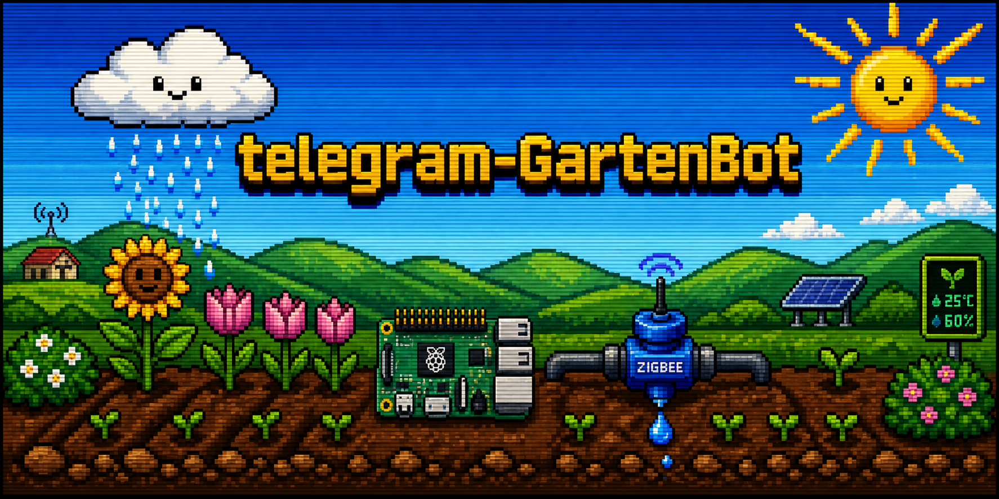

<div align="center">



<h1>💧 Smart Garden Irrigation Daemon</h1>

<p><strong>Gartenbewässerungs-Steuerung für den Raspberry Pi Zero W — intelligent, offline-first, per Telegram gesteuert.</strong></p>

<p>
  
  
  
  
</p>

</div>

Ein extrem leichtgewichtiger, offline-fähiger und hochsicherer Hintergrunddienst (Daemon) zur intelligenten Steuerung eines **Sonoff Hydro ONE (Zigbee 3.0)** Wasserventils — ergänzt um einen lokalen Regensensor und eine optionale Garten-Kamera.

Bedient wird er sicher von überall über einen whitelist-basierten **Telegram-Bot** per Long-Polling — dadurch sind **keine offenen Ports** (Portweiterleitung/NAT-Traversal) an deinem Router nötig.

---

## 📑 Inhalt

- [✨ Highlights](#-highlights)
- [🚀 Schnellstart (ohne Hardware)](#-schnellstart-ohne-hardware)
- [🧩 Architektur](#-architektur)
- [📂 Projektstruktur](#-projektstruktur)
- [📥 Installation auf dem Raspberry Pi](#-installation-auf-dem-raspberry-pi)
- [🤖 Bedienung im Telegram-Bot](#-bedienung-im-telegram-bot)
- [📦 Zigbee2MQTT-Vendoring](#-zigbee2mqtt-vendoring)
- [🔄 OTA-Updates](#-ota-updates)
- [🩺 Troubleshooting](#-troubleshooting)
- [🧪 Entwicklung und Tests](#-entwicklung-und-tests)
- [🤝 Mitwirken](#-mitwirken)
- [🔒 Sicherheit](#-sicherheit)
- [📄 Lizenz](#-lizenz)

---

## ✨ Highlights

*   **🟢 Kombinierter Guss (First-to-Hit Limit):** Zuverlässiger Überflutungsschutz. Jeder Bewässerungslauf (manuell wie geplant) überwacht *parallel* ein **Zeitlimit** (Minuten) und ein **Volumenlimit** (Liter). Das Ventil schließt automatisch, sobald der *erste* Grenzwert erreicht wird (z. B. 50 Liter fließen ODER 15 Minuten verstreichen).
*   **📡 Mehrfach-Ventil-Unterstützung:** Kopple und benenne beliebig viele Sonoff Hydro ONE Ventile über den Telegram-Bot. Zeitpläne steuern mehrere Ventile **sequentiell** (nacheinander, druckschonend) oder **parallel** (gleichzeitig, jedes mit eigenem Grenzwert). Live-Status und Tagesbericht zeigen Batterie, Signalstärke und letztes Lebenszeichen pro Ventil separat an.
*   **📅 Geführter Zeitplan-Assistent:** Erstelle *und bearbeite* Zeitpläne in 6 Schritten direkt im Chat über Inline-Tastaturen — freie Namenseingabe, Stunden-Raster (6×4), 5-Minuten-Schritte, Dauer- und Volumen-Schnellwahl (5–25 Min bzw. 10/25/50/80 L, jeweils mit Option für eigene Werte) sowie Multi-Select-Wochentage. Alternativ legt der Power-User-Befehl `/add <Name>, <Uhrzeit>, <Tage>, <Dauer>, [Menge_Liter]` einen Zeitplan in einer Zeile an.
*   **🌧️ Lokaler Regensensor (primäre Niederschlagsquelle):** Ein gekoppelter Funk-Regensensor (Aqua Scope RANWIE01) meldet gemessenen Regen per MQTT. Er ist die **primäre** Quelle für den *gefallenen* Regen der letzten 24 h; ist der Sensor länger als `RAIN_SENSOR_OFFLINE_HOURS` offline, greift automatisch das ERA5-Archiv als Fallback. Die *Vorhersage* der nächsten 24 h liefert weiterhin Open-Meteo (ADR 0028). Setzt während eines laufenden Gusses Regen ein, wird der Guss **sofort unterbrochen**; beim Ein- und Aussetzen von Regen erfolgt zudem eine Flanken-Benachrichtigung.
*   **🪴 Graduierte Gieß-Steuerung & Gieß-Empfehlung (`/giesscheck`):** Statt eines binären „gießen/überspringen“ berechnet der Daemon aus gefallenem + erwartetem Regen sowie der Temperatur einen **Skalierungsfaktor von 0–100 %**. Ein geplanter Guss wird also bei leichtem Regen nur *reduziert* statt komplett übersprungen. Eine **Hitzestrecke** (mehrere heiße Tage in Folge) erhöht den Bedarf. `/giesscheck` liefert jederzeit ein Verdict mit klarer Begründung.
*   **📷 Garten-Kamera (optional, M5Stack Timer Camera F):** Kopple eine batteriebetriebene Kamera über `/camera_setup` (Wizard: Name, Aufnahme-Intervall, Auflösung VGA/XGA/UXGA, Bildqualität Hoch/Mittel/Niedrig). **Getimte Aufnahmen** zu frei konfigurierten Uhrzeiten (`/aufnahmen`), Abruf des aktuellen Bildes per `/photo`, automatisches Foto kurz nach jedem Guss sowie Löschen der Bild-Historie per `/photo_clear`. Die Bilder liegen als einzelne JPGs im **Dateisystem** (`data/camera/<name>/`); ein täglicher Job löscht Aufnahmen älter als `CAMERA_CLEANUP_DAYS` (Standard 30 Tage), behält aber ein Bild pro Tag als Langzeit-Archiv. Akkustand und Online-Status erscheinen im `/status`.
*   **🐕 Inaktivitäts-Watchdog:** Proaktive Überwachung batteriebetriebener Geräte. Bleibt das Lebenszeichen eines Ventils (z. B. > 24 h), eine Messung des Regensensors (z. B. > 18 h) oder ein Lebenszeichen der Kamera aus, warnt der Bot sofort vor einem Verbindungs- oder Batterieausfall.
*   **🚨 Unerwartete-Ventilöffnung-Alarm:** Öffnet ein Ventil ohne aktiven Guss (z. B. durch manuelle Betätigung oder Fehlfunktion), meldet der Bot dies umgehend per Push.
*   **🌦️ Wettervorhersage & Offline-Cache:** Der Daemon holt regelmäßig (alle ~30 Min) die Open-Meteo-Vorhersage und legt sie lokal in SQLite ab. Durch dieses Cache-first-Vorgehen bleibt die Gieß-Entscheidung auch bei temporärem Internetausfall funktionsfähig. Ein Wetterchart visualisiert ±24 h Regen inklusive „Jetzt“-Markierung.
*   **🔌 Live-Verbindungsanzeige:** `/status` zeigt in Echtzeit den MQTT-Brokerstatus und für jedes Ventil separat Verbindung, Batterie und Signalqualität — mit Garten-Ampel (🟢/🟡/🔴) und Progressive Disclosure (technische Details nur bei Problemen).
*   **🔄 OTA-Software-Update (`/update`):** Aktualisiert den Daemon direkt aus dem Chat über GitHub-Releases inkl. Release-Notes, automatischer Telegram-Bestätigung und Rollback bei Fehlschlag — ohne SSH-Zugriff.
*   **⚙️ In-Chat-Einstellungen (`/einstellungen`):** Schwellenwerte (z. B. Regenschwelle, Gießcheck-Parameter) lassen sich direkt im Chat anpassen.
*   **⚡ Minimaler Footprint:** Telegram-Anbindung, Open-Meteo-Abruf und Kamera-Empfänger laufen rein auf der Python-Standardbibliothek (`urllib.request`, `http.server`). Keine schweren Frameworks – optimiert für den Single-Core-Prozessor des Pi Zero W. Einzige produktive Drittabhängigkeit ist `paho-mqtt`.

---

## 🚀 Schnellstart (ohne Hardware)

Du brauchst zum Ausprobieren **keinen Pi, keinen USB-Stick und keinen MQTT-Broker**. Die Testsuite läuft vollständig offline gegen einen simulierten MQTT-Adapter:

```bash
git clone https://github.com/g41nxe/telegram-GartenBot.git
cd telegram-GartenBot
pip install -r requirements-dev.txt   # pytest
python -m pytest tests                # komplette Suite, offline
```

Den Daemon selbst lokal starten:

```bash
python -m src.daemon.main
```

> [!TIP]
> Ist `paho-mqtt` **nicht** installiert, schaltet der Daemon automatisch in den **Simulationsmodus** (`SimulatedMqttAdapter`, konstanter Durchfluss 5 L/Min). Mit installiertem `paho-mqtt` versucht er, sich mit einem echten Broker auf `127.0.0.1:1883` zu verbinden. Ohne gesetzten `TELEGRAM_BOT_TOKEN` läuft der Daemon, aber der Bot bleibt inaktiv.

---

## 🧩 Architektur

Das System arbeitet vollkommen lokal auf der Steuerzentrale (Raspberry Pi Zero W). Der Daemon folgt einer **Hexagonalen Architektur** mit ereignisgesteuertem Kern (`EventBus`); Details in [`ARCHITECTURE.md`](ARCHITECTURE.md).

```mermaid
graph TD
    User[📱 Telegram App] <-->|Long-Polling| Bot[🤖 Telegram-UI]
    Bot -->|Befehle| Ctrl[🌊 Guss-Steuerung]
    Scheduler[⏰ Scheduler] -->|Geplante Güsse| Ctrl
    Scheduler -->|Cache-Warmup ~30 Min| Weather[🌤️ Open-Meteo]
    Weather --> DB[(💾 SQLite)]
    Ctrl -->|Öffnen/Schließen| MQTT[📡 MQTT-Client]
    MQTT <-->|via Zigbee2MQTT| Valve[💧 Sonoff Hydro ONE]
    RainSensor[🌧️ Regensensor] -->|Messungen| MQTT
    MQTT -->|Status- & Sensor-Events| Bus((🔔 Ereignis-Kanal))
    Bus -->|Volumen / Regen-Stopp| Ctrl
    Bus -->|Benachrichtigungen| Bot
    Bus -->|Archivierung| DB
    Bus -->|Inaktivität| Watchdog[🐕 Watchdog]
    Camera[📷 Garten-Kamera] -->|HTTP Upload| CamRx[🖼️ Kamera-Empfänger]
    CamRx -->|JPG-Bilder| FS[(🗂️ Dateisystem data/camera)]
    CamRx -->|Metadaten| DB
    CamRx -->|Bild-Events| Bus
```



---

## 📂 Projektstruktur

```text
/
├── CONTEXT.md               # Projektspezifische Ubiquitous Language (Glossar)
├── ARCHITECTURE.md          # Architekturregeln (Hexagonal Architecture, EventBus)
├── CHANGELOG.md             # Versions-Historie
├── README.md                # Diese Dokumentation
├── config/
│   └── garden.conf          # Versionierte, nicht-geheime Einstellungen (Schwellwerte, Timeouts, MQTT, Kamera)
├── .env.template            # Vorlage für Secrets & standortspezifische Werte (→ .env)
├── garden.db                # Lokale SQLite-Datenbank — wird auf der Steuerzentrale erzeugt
├── docs/
│   ├── adr/                 # Architekturentscheidungen (ADRs 0001–0032)
│   ├── features/            # Feature-Spezifikationen (completed/ für abgeschlossene)
│   ├── plans/               # Detaillierte Umsetzungspläne (completed/ für abgeschlossene)
│   ├── design/              # Telegram Design-System & Nachrichten-Referenz (SOLL/IST)
│   ├── research/            # Geräte- und Hardware-Recherche
│   ├── assets/              # Bilder & Diagramme für die Doku
│   └── ideas/               # Ideen-Backlog
├── scripts/
│   ├── deploy.ps1           # PowerShell-Bereitstellungsskript (Windows → Steuerzentrale)
│   ├── setup.sh             # Vollautomatisches Installationsskript (alle Dienste)
│   ├── update.sh            # OTA-Update-Skript (GitHub-Release → laufender Dienst)
│   ├── migrate_zigbee_adapter.sh  # ezsp→ember Adapter-Migration (Dongle-Firmware-Upgrade)
│   └── run_coverage.{sh,ps1}      # Test-Coverage-Runner (Linux/Windows)
├── src/
│   └── daemon/
│       ├── config.py        # Lädt config/garden.conf, dann .env; alle Laufzeit-Konstanten
│       ├── scheduler.py     # Zeitsteuerung & sequentielle/parallele Ventil-Queue
│       ├── main.py          # Zentraler Programmeinstieg & IoC-Verdrahtung
│       ├── core/            # Domänenlogik (kein I/O)
│       │   ├── event_bus.py             # Thread-sicherer synchroner Ereignis-Kanal
│       │   ├── watering_controller.py   # Guss-Steuerung mit Multi-Ventil-Support
│       │   ├── watering_advice.py       # Reine Gieß-Empfehlung & graduierter Skalierungsfaktor
│       │   ├── watering_events.py       # Guss-Ereignistypen (Start, Abschluss, Unterbrechung)
│       │   ├── scheduler_events.py      # Domänen-Ereignistypen (Zeitsteuerung, Reports)
│       │   ├── valve_events.py          # Ventil-Ereignistypen (Kopplung, Status)
│       │   ├── sensor_events.py         # Regensensor-Ereignistypen
│       │   ├── watchdog_events.py       # Inaktivitäts-Ereignistypen
│       │   ├── camera_events.py         # Kamera-Ereignistypen (Bild, Status, Kopplung)
│       │   ├── camera_schedule.py       # Reine Logik für getimte Kamera-Aufnahmen
│       │   └── weather_codes.py         # WMO-Wettercode-Definitionen
│       ├── adapters/        # Äußere Grenze — kein Cross-Adapter-Import
│       │   ├── database.py              # SQLite CRUD (Zeitpläne, Ventile, Verlauf, Wetter, Regenmessungen, Kamera-Metadaten) — keine Bilddaten
│       │   ├── database_adapter.py      # Domänen-Events → Datenbank-Archivierung
│       │   ├── mqtt_client.py           # MQTT-Schnittstelle + Simulations-Adapter
│       │   ├── weather.py               # Open-Meteo HTTP-Adapter & Skip-Logik
│       │   ├── chart.py                 # QuickChart.io-Adapter (Wetterchart-PNG)
│       │   ├── daily_report.py          # Täglicher Statusbericht (pro Ventil)
│       │   ├── watchdog.py              # Überwachung inaktiver Geräte (Ventile, Sensor, Kamera)
│       │   ├── valve_pairing.py         # Ventil-Kopplung (Zigbee-Join + DB-Registrierung)
│       │   ├── camera_pairing.py        # Kamera-Kopplung
│       │   └── camera_receiver.py       # HTTP-Empfänger für Kamera-Uploads
│       └── ui/              # Benutzeroberfläche (Telegram)
│           ├── telegram_client.py       # Raw HTTP Telegram API (nur Stdlib)
│           └── telegram_ui.py           # Bot-Befehle, Wizards, Benachrichtigungen & Event-Handler
├── vendor/
│   └── zigbee2mqtt/         # Lokale, modifizierte Zigbee2MQTT-Quellen (Mittelweg-Dienst)
└── tests/
    ├── test_irrigation.py   # Integrationstests (Offline-Simulationsmodus)
    ├── test_config.py       # Konfigurations-Lade-Tests
    ├── core/                # Unit-Tests für Domänen-Kern
    ├── adapters/            # Unit-Tests für Adapter (DB, MQTT, Pairing, Regensensor, Kamera)
    └── ui/                  # Unit-Tests für Telegram-UI & Wizards
```

---

## 📥 Installation auf dem Raspberry Pi

### Voraussetzungen

**Hardware**

| Rolle | Gerät | Status |
|---|---|---|
| Steuerzentrale | Raspberry Pi Zero W (oder neuer) | erforderlich |
| Funk-Koordinator | Sonoff Zigbee 3.0 USB Dongle Plus | erforderlich |
| Ventil | Sonoff Hydro ONE Smart-Wasserlaufventil | erforderlich |
| Regensensor | Funk-Regensensor (Aqua Scope RANWIE01) | empfohlen |
| Kamera | M5Stack Timer Camera F | optional |

**Software auf der Steuerzentrale** — `scripts/setup.sh` richtet diese selbstständig ein:

| Komponente | Version | Quelle | Zweck |
|---|---|---|---|
| **Python** | `>= 3.9` | vorinstalliert im OS | Ausführung des Daemons |
| **paho-mqtt** | `~1.6` (`python3-paho-mqtt`) | `apt` | MQTT-Kommunikation |
| **Mosquitto** | `mosquitto` & `mosquitto-clients` | `apt` | Lokaler MQTT-Broker |
| **Node.js** | `v20.11.1` (ARMv6-Build) | unofficial-builds.nodejs.org | Laufzeit für Zigbee2MQTT |
| **Zigbee2MQTT** | `v2.10.1` | lokaler Build (siehe Vendoring) | Mittelweg-Dienst Zigbee → MQTT |
| **System-Tools** | `git`, `curl` | `apt` | Repo & Download-Utilities |

**Entwicklungsmaschine (Windows)** — nur für das Deployment via `scripts/deploy.ps1` nötig:

*   **PowerShell** (Windows-Standard)
*   **Node.js + npm** — baut Zigbee2MQTT lokal (der Pi hat dafür zu wenig RAM)
*   **OpenSSH-Client** (`ssh`/`scp`, in Windows 10/11 enthalten) — Übertragung & Remote-Setup

> [!IMPORTANT]
> **Firmware-Upgrade des Funk-Koordinators (ZBDongle-E / EZSP v8 → v13+):**
> Aktualisierst du die Dongle-Firmware auf `v7.4` (oder neuer), halte unbedingt diesen Migrations-Workflow ein, da sonst das Backup-File beschädigt wird und du dein gesamtes Zigbee-Netzwerk neu anlernen musst (siehe `scripts/migrate_zigbee_adapter.sh`):
> 1. Konfiguriere Zigbee2MQTT beim ersten Start nach dem Upgrade zwingend mit `adapter: ezsp` in der `configuration.yaml` (NICHT direkt mit `adapter: ember` starten!).
> 2. Lass Zigbee2MQTT einmal vollständig mit `ezsp` starten, um die interne Backup-Datei auf das neue Format zu migrieren.
> 3. Ändere erst danach den Wert auf `adapter: ember` (bzw. entferne den Eintrag, da `ember` der Standardwert ist).

### Schritt 1 — Konfiguration anlegen

Die Konfiguration ist bewusst getrennt (ADR 0030):

*   **`config/garden.conf`** (versioniert, mit jedem Release ausgeliefert): allgemeine, nicht-geheime Einstellungen — Schwellenwerte, Timeouts, MQTT-Topics, Regensensor- und Kamera-Parameter. Wird bei OTA-Updates aktualisiert.
*   **`.env`** (gitignored, durch OTA *nie* überschrieben): Secrets und standortspezifische Werte.

```bash
cp .env.template .env
nano .env
```

Die `.env.template` ist die maßgebliche Referenz aller Variablen. Mindestens setzen musst du:

```ini
TELEGRAM_BOT_TOKEN=...        # vom @BotFather
TELEGRAM_ALLOWED_USER_IDS=... # deine Telegram-User-ID (Whitelist)
LATITUDE=52.0                 # Standort für Open-Meteo
LONGITUDE=13.0
```

Für OTA-Updates zusätzlich `GITHUB_PAT` / `GITHUB_REPO`, für das Deployment `DEPLOY_PI_HOST` / `DEPLOY_PI_USER`. Alle übrigen Vorgaben stammen aus `config/garden.conf`.

### Schritt 2 — Projektdateien übertragen (Windows → Pi)

```powershell
.\scripts\deploy.ps1            # baut Zigbee2MQTT lokal & überträgt src/, scripts/, config/, tools/ nach ~/garden/
.\scripts\deploy.ps1 -CopyEnv   # Erstsetup: zusätzlich die .env übertragen
```

Host und Benutzer werden aus `.env` (`DEPLOY_PI_HOST` / `DEPLOY_PI_USER`) gelesen bzw. abgefragt. Beim **Erstsetup** startet `deploy.ps1` anschließend automatisch `scripts/setup.sh` auf dem Pi; bei späteren Code-Änderungen wird stattdessen nur der Dienst neu gestartet.

### Schritt 3 — Setup auf dem Pi (nur Erstsetup, falls manuell)

```bash
ssh <user>@<pi-ip>
cd ~/garden && bash scripts/setup.sh
```

Das Skript richtet **alle drei Systemdienste** ein. Startreihenfolge beim Booten: **Mosquitto → Zigbee2MQTT → Bewässerungs-Daemon**.

| Dienst | Beschreibung |
|---|---|
| `mosquitto` | MQTT-Broker |
| `zigbee2mqtt` | Mittelweg-Dienst (Funk-Koordinator → MQTT) |
| `garden-irrigation` | Bewässerungs-Daemon |

> [!NOTE]
> **Erstes Ventil koppeln:** Das Setup richtet das System ein — das erste Ventil koppelst du danach im Bot. Drücke **`🔧 Ventil koppeln`**, vergib einen Wunschnamen (z. B. „Garten“), und halte dann den **Reset-Knopf am Sonoff Hydro ONE 5 Sekunden**. Das Ventil wird automatisch erkannt und registriert.

> [!TIP]
> **Reine Code-Änderungen** brauchen kein erneutes `setup.sh` — ein Dienst-Neustart genügt. `database.init_db()` führt Schema-Migrationen beim Start automatisch aus. `setup.sh` ist nur bei geänderten systemd-Units oder neuen OS-Paketen nötig.
> ```bash
> sudo systemctl restart garden-irrigation
> journalctl -u garden-irrigation -n 50 --no-pager
> ```

### Schritt 4 — Ergebnis prüfen

```bash
sudo systemctl status mosquitto zigbee2mqtt garden-irrigation
```

Oder den Telegram-Bot öffnen und `/status` senden.

---

## 🤖 Bedienung im Telegram-Bot

Der Bot bietet ein permanentes Tastenmenü am unteren Bildschirmrand sowie ein natives `/`-Befehlsmenü.

### Bewässerung
*   **📊 Status (`/status`):** Dashboard mit MQTT-Brokerstatus, Zustand aller Ventile (Verbindung, Batterie, Signalstärke), Regensensor- und Kamera-Status, Wetterdaten, nächster Bewässerung und Verlauf — mit Garten-Ampel 🟢/🟡/🔴.
*   **📅 Zeitsteuerung (`/zeitplan`):** Listet aktive Zeitpläne, bietet **`➕ Neuer Zeitplan`** (geführter Assistent) und das Bearbeiten bestehender Zeitpläne.
*   **🚿 Bewässern starten:** Zweistufiger manueller Guss-Assistent für Zeitlimit (Minuten) und Volumenlimit (Liter).
*   **🛑 Sofort Stopp (`/stop`):** Schließt alle aktiven Ventile unverzüglich und bricht alle Scheduler-Threads ab.
*   **🪴 Gieß-Empfehlung (`/giesscheck`):** Verdict + Begründung auf Basis von Regen-Fenster, Temperatur und Hitzestrecke.
*   **📈 Tagesbericht (`/report`):** Manueller Abruf des kompakten Tages-Briefings inkl. Wetterchart.

### Geräte koppeln
*   **🔧 Ventil koppeln (`/setup`):** Fragt zuerst nach einem **Wunschnamen** (z. B. „Terrasse“), dann wird der Reset-Knopf am Sonoff Hydro ONE gedrückt. Das Ventil erhält automatisch einen eindeutigen MQTT-Namen (`valve_<letzte 4 Stellen der IEEE-Adresse>`) und wird registriert. Mehrere Ventile lassen sich nacheinander hinzufügen.
*   **📷 Kamera koppeln (`/camera_setup`):** 4-Schritte-Wizard (Name, Aufnahme-Intervall, Auflösung VGA/XGA/UXGA, Bildqualität Hoch/Mittel/Niedrig).

### Kamera
*   **🖼️ Aktuelles Bild (`/photo`):** Fordert ein frisches Foto an; die Caption zeigt den Aufnahmezeitstempel.
*   **⏱️ Foto-Uhrzeiten (`/aufnahmen`):** Verwaltung der getimten Aufnahmezeitpunkte (mit Wizard).
*   **🗑️ Bild-Historie löschen (`/photo_clear`):** Löscht die Bild-Historie der Kamera (mit Rückfrage).

### System
*   **🔄 Software-Update (`/update`):** OTA-Update aus dem neuesten GitHub-Release inkl. Release-Notes und Erfolgs-/Rollback-Meldung.
*   **⚙️ Einstellungen (`/einstellungen`):** Passt Schwellenwerte direkt im Chat an.

---

## 📦 Zigbee2MQTT-Vendoring

Der Mittelweg-Dienst (Zigbee2MQTT) wird als lokaler Quellcode in `vendor/zigbee2mqtt/` verwaltet („gevendort“) — aus zwei Gründen:

1. **Ressourcenschonung (Vorkompilierung):** Die TypeScript-Kompilierung (`tsc`) überlastet den Pi Zero W (ARMv6, 512 MB RAM) und stürzt ohne großen Swap ab. Daher wird der Dienst lokal auf dem Windows-Host gebaut (`scripts/deploy.ps1`) und als Archiv (`zigbee2mqtt.tar.gz`) auf den Pi übertragen.
2. **CommonJS-Kompatibilität (Debounce-Downgrade):** Die höchste für ARMv6 verfügbare Node.js-Version (`v20.11.1`) unterstützt kein `require()` reiner ES-Module. Da `debounce@^3.0.0` ein reines ES-Modul ist, scheiterte der Start. In `vendor/zigbee2mqtt/package.json` wurde `debounce` daher auf `^1.2.1` (CommonJS) downgegradet.

Details: [ADR 0010](docs/adr/0010-vorkompilierte-bereitstellung-des-mittelweg-dienstes.md).

---

## 🔄 OTA-Updates

Updates erfolgen ohne SSH direkt aus dem Telegram-Chat über `/update`:

*   Der Daemon prüft das in `.env` hinterlegte GitHub-Repository (`GITHUB_REPO`, authentifiziert per `GITHUB_PAT`) auf das neueste Release.
*   `scripts/update.sh` entpackt das Release-Archiv (inkl. `config/`), startet den Dienst neu und meldet **Erfolg oder Rollback** per Telegram zurück.
*   Die geheime `.env` wird dabei **nie** überschrieben — nur versionierte Dateien werden aktualisiert.

Hintergrund: [ADR 0023](docs/adr/0023-ota-update-via-github-actions-und-releases.md).

---

## 🩺 Troubleshooting

| Symptom | Mögliche Ursache & Abhilfe |
|---|---|
| **Bot antwortet nicht** | `TELEGRAM_BOT_TOKEN` fehlt/falsch in `.env`, oder deine User-ID steht nicht in `TELEGRAM_ALLOWED_USER_IDS` (Whitelist). Logs: `journalctl -u garden-irrigation -n 50`. |
| **`/status` zeigt MQTT offline** | Broker prüfen: `sudo systemctl status mosquitto`. Verbindung testen: `mosquitto_sub -t '#' -v`. |
| **Ventil wird beim Koppeln nicht gefunden** | Zigbee2MQTT muss laufen (`sudo systemctl status zigbee2mqtt`) und der Join muss erlaubt sein. Reset-Knopf wirklich 5 s halten. |
| **Zigbee2MQTT startet nicht / Backup-Fehler** | Meist Folge eines Dongle-Firmware-Upgrades — siehe `ezsp`→`ember`-Hinweis unter [Installation](#-installation-auf-dem-raspberry-pi) bzw. `scripts/migrate_zigbee_adapter.sh`. |
| **Kein Wetter-Skip / Regensensor offline** | Bleibt der Sensor länger als `RAIN_SENSOR_OFFLINE_HOURS` stumm, fällt die Quelle automatisch auf das ERA5-Archiv zurück (im `/status` ausgewiesen). |
| **Kamera-Upload schlägt fehl** | Bilder > `CAMERA_MAX_UPLOAD_BYTES` oder ungültige JPEGs werden abgewiesen; nicht gekoppelte Kameras erhalten `403`. Port `CAMERA_RECEIVER_PORT` (Standard 8080) muss erreichbar sein. |
| **`python -m daemon.main` schlägt fehl** | Der korrekte Modulpfad ist `python -m src.daemon.main` (aus dem Repo-Root). |

---

## 🧪 Entwicklung und Tests

Das gesamte System lässt sich lokal testen — siehe [Schnellstart](#-schnellstart-ohne-hardware). Die Testsuite forciert den Simulationsmodus (`HAS_PAHO = False`) und kommt ganz ohne MQTT-Broker oder Telegram-Verbindung aus.

```bash
pip install -r requirements-dev.txt   # einmalig: pytest
python -m pytest tests                 # komplette Suite
python -m pytest tests/core            # nur Domänen-Kern
```

**Coverage messen** (darf nicht regredieren):

```bash
bash scripts/run_coverage.sh      # Linux/Pi
.\scripts\run_coverage.ps1        # Windows
```

Die Tests decken Datenbank-Schema und CRUD, Multi-Ventil-Kopplung, Zeitsteuerung (sequentiell/parallel), Regensensor-Integration, graduierte Gieß-Steuerung & -Empfehlung, Wetter-Skips, Kamera-Kopplung/-Empfänger/-Zeitplan, Telegram-Wizards, Simulator-Status und die First-to-Hit-Abschaltung ab.

---

## 🤝 Mitwirken

Vor Änderungen am Code lies in dieser Reihenfolge:

1. [`CONTEXT.md`](CONTEXT.md) — Domänensprache (Ubiquitous Language). Nutze die exakten deutschen Begriffe.
2. [`ARCHITECTURE.md`](ARCHITECTURE.md) — strukturelle Regeln (zustandslose Adapter, EventBus, Core ohne I/O).
3. [`docs/adr/`](docs/adr/) — Architekturentscheidungen (ADRs 0001–0032). Abweichungen explizit kennzeichnen.

Weitere Konventionen:

*   **Aufgaben** werden mit dem **Beads**-Issue-Tracker verwaltet (`bd ready`, `bd show <id>`).
*   **TDD:** Schreibe zuerst einen fehlschlagenden Test; Coverage darf nicht sinken.
*   **Telegram-Nachrichten:** Neue/geänderte benutzersichtbare Texte müssen dem Design-System entsprechen und in [`docs/design/telegram-nachrichten.html`](docs/design/telegram-nachrichten.html) gespiegelt werden.

---

## 🔒 Sicherheit

*   **Keine offenen Ports:** Telegram-Long-Polling kommt ohne Portweiterleitung/NAT-Traversal aus — der Pi initiiert alle Verbindungen ausgehend.
*   **Whitelist:** Nur Telegram-User-IDs aus `TELEGRAM_ALLOWED_USER_IDS` dürfen den Bot steuern.
*   **Secrets bleiben lokal:** Token, PAT und Koordinaten liegen ausschließlich in der gitignorierten `.env` auf dem Pi und werden durch OTA-Updates nie überschrieben.
*   **Kamera-Token-Schutz:** Die Kameras sprechen nie direkt mit der Telegram-API, sondern laden per HTTP auf den lokalen Empfänger hoch — das Bot-Token verlässt den Pi nicht (ADR 0026).
*   **Fail-safe Überflutungsschutz (zweistufig, ADR 0005):** Im Normalbetrieb schließt der Daemon das Ventil nach Ablauf der Dauer (Software-Cap `SAFETY_TIMEOUT_MINUTES`). Zusätzlich ist die **native Auto-Close-Funktion (Inching) des Ventils** über Zigbee2MQTT auf ein festes Sicherheits-Timeout konfiguriert — das Ventil schließt damit auch dann physisch, wenn der Pi abstürzt oder die Funkverbindung abreißt.

---

## 📄 Lizenz

Für dieses Projekt ist derzeit **keine Lizenz** hinterlegt. Ohne ausdrückliche Lizenz gelten die Standard-Urheberrechte — eine Nutzung/Weiterverbreitung sollte vorab mit dem Autor geklärt werden. *(Empfehlung: eine `LICENSE`-Datei ergänzen, z. B. MIT.)*
