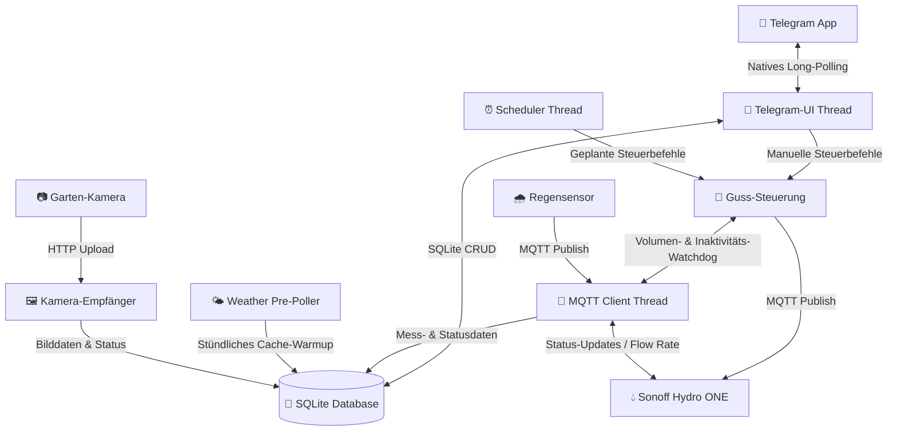

# 💧 Smart Garden Irrigation Daemon (Gartenbewässerungs-Steuerung)

Ein extrem leichtgewichtiger, offline-fähiger und hochsicherer Hintergrunddienst (Daemon) für den **Raspberry Pi Zero W** zur intelligenten Steuerung eines **Sonoff Hydro ONE (Zigbee 3.0)** Wasserventils — ergänzt um einen lokalen Regensensor und eine optionale Garten-Kamera.

Die Steuerung erfolgt weltweit gesichert über einen whitelist-basierten **Telegram-Bot** per Long-Polling, wodurch **keine offenen Ports** (Portweiterleitung/NAT-Traversal) an Ihrem Router benötigt werden.

---

## ✨ Hauptmerkmale

*   **🟢 Kombinierter Guss (First-to-Hit Limit):** Ultimativer Überflutungsschutz. Jeder Bewässerungslauf (sowohl manuell als auch geplant) überwacht *parallel* ein **Zeitlimit** (Minuten) und ein **Volumenlimit** (Liter). Das Ventil schließt automatisch, sobald der *erste* Grenzwert erreicht wird (z. B. 50 Liter fließen ODER 15 Minuten verstreichen).
*   **📡 Mehrfach-Ventil-Unterstützung:** Koppeln und benennen Sie beliebig viele Sonoff Hydro ONE Ventile über den Telegram-Bot (`🔧 Ventil koppeln`). Zeitpläne können mehrere Ventile **sequentiell** (nacheinander, druckschonend) oder **parallel** (gleichzeitig, jedes mit eigenem Grenzwert) steuern. Live-Status und Tagesbericht zeigen Batterie, Signalstärke und letztes Lebenszeichen pro Ventil separat an.
*   **📅 Geführter Zeitplan-Assistent (Guided Wizard):** Erstellen *und bearbeiten* Sie komplexe Zeitpläne Schritt-für-Schritt direkt im Telegram-Chat über intuitive Inline-Tastaturen (freie Namenseingabe, Stundenraster, 5-Minuten-Schritte, Kleingarten-Presets und Multi-Select-Wochentage).
*   **🌧️ Lokaler Regensensor (primäre Niederschlagsquelle):** Ein gekoppelter Funk-Regensensor (Aqua Scope RANWIE01) meldet gemessenen Regen per MQTT. Diese lokalen Messwerte sind die **maßgebliche** Quelle für die Bewässerungs-Entscheidung; die Open-Meteo-Vorhersage dient als Ergänzung und Fallback. Setzt während eines laufenden Gusses Regen ein, wird der Guss **sofort unterbrochen**. Beim Ein- und Aussetzen von Regen erfolgt eine Flanken-Benachrichtigung.
*   **🪴 Graduierte Gieß-Steuerung & Gieß-Empfehlung (`/giesscheck`):** Statt eines binären „gießen/überspringen“ berechnet der Daemon aus gefallenem + erwartetem Regen sowie der Temperatur einen **Skalierungsfaktor von 0–100 %**. Ein geplanter Guss wird also bei leichtem Regen nur *reduziert* statt komplett übersprungen. Eine **Hitzestrecke** (mehrere heiße Tage in Folge) erhöht den Bedarf. `/giesscheck` liefert jederzeit ein Verdict mit klarer Begründung.
*   **📷 Garten-Kamera (optional, M5Stack Timer Camera F):** Koppeln Sie eine batteriebetriebene Kamera über `/camera_setup` (Wizard: Name, Intervall, Auflösung VGA/XGA/UXGA, Bildqualität). **Getimte Aufnahmen** zu frei konfigurierten Uhrzeiten (`/aufnahmen`), Abruf des aktuellen Bildes per `/photo`, automatisches Foto kurz nach jedem Guss, **Zeitraffer-GIF** aus der Bild-Historie und Löschen der Historie per `/photo_clear`. Akkustand und Online-Status erscheinen im `/status`.
*   **🐕 Inaktivitäts-Watchdog:** Proaktive Überwachung batteriebetriebener Geräte. Bleibt das Lebenszeichen eines Ventils (z. B. > 24 Stunden), eine Messung des Regensensors (z. B. > 18 Stunden) oder ein Lebenszeichen der Kamera aus, warnt der Bot sofort vor einem Verbindungs- oder Batterieausfall.
*   **🚨 Unerwartete-Ventilöffnung-Alarm:** Öffnet ein Ventil ohne aktiven Guss (z. B. durch manuelle Betätigung oder Fehlfunktion), meldet der Bot dies umgehend per Push.
*   **🌦️ Intelligenter Wetter-Skip (Offline-first):** Open-Meteo API-Anbindung prüft im Hintergrund Regen (gemessene letzte 24h + Vorhersage nächste 24h). Durch lokale SQLite-Zwischenspeicherung (Cache-first) funktioniert die Entscheidung auch bei temporärem Internetausfall. Ein Wetterchart visualisiert ±24 h Regen inklusive „Jetzt“-Markierung.
*   **🔌 Live-Verbindungsanzeige:** Der Status-Bildschirm (`/status`) visualisiert in Echtzeit, ob die MQTT-Brokerverbindung steht und zeigt für jedes registrierte Ventil separat: Verbindungsstatus, Batteriestand und Signalqualität — mit Garten-Ampel (🟢/🟡/🔴) und Progressive Disclosure (technische Details nur bei Problemen).
*   **🔄 OTA-Software-Update (`/update`):** Aktualisiert den Daemon direkt aus dem Chat über GitHub-Releases inkl. Release-Notes, automatischer Telegram-Bestätigung und Rollback bei Fehlschlag — ohne SSH-Zugriff.
*   **⚙️ In-Chat-Einstellungen (`/einstellungen`):** Schwellenwerte (z. B. Regenschwelle, Gießcheck-Parameter) lassen sich direkt im Telegram-Chat anpassen.
*   **⚡ 100 % Abhängigkeitsfrei (Telegram & API):** Telegram-Anbindung, Open-Meteo-Abruf und Kamera-Empfänger sind komplett auf Basis der Python-Standardbibliotheken (`urllib.request`, `http.server`) entwickelt. Keine schweren Frameworks – perfekt optimiert für den ressourcenschwachen Single-Core-Prozessor der Steuerzentrale (Pi Zero W). Einzige produktive Drittabhängigkeit ist `paho-mqtt`.

---

## 🛠️ Systemarchitektur & Ablauf

Das System arbeitet vollkommen lokal auf Ihrer Steuerzentrale (Raspberry Pi Zero W):



---

## 📂 Verzeichnisstruktur

```text
/
├── CONTEXT.md               # Projektspezifische Ubiquitous Language (Glossar)
├── ARCHITECTURE.md          # Architekturregeln (Hexagonal Architecture, EventBus)
├── CHANGELOG.md             # Versions-Historie
├── README.md                # Diese Dokumentation
├── config/
│   └── garden.conf          # Versionierte, nicht-geheime Einstellungen (Schwellwerte, Timeouts, MQTT, Kamera)
├── .env.template            # Vorlage für Secrets & standortspezifische Werte (→ .env)
├── garden.db                # Lokale SQLite-Datenbank (Zeitpläne, Ventile, Verlauf) — wird auf der Steuerzentrale erzeugt
├── docs/
│   ├── adr/                 # Architekturentscheidungen (ADRs 0001–0032)
│   ├── features/            # Feature-Spezifikationen (completed/ für abgeschlossene)
│   ├── plans/               # Detaillierte Umsetzungspläne (completed/ für abgeschlossene)
│   ├── design/              # Telegram Design-System & Nachrichten-Referenz (SOLL/IST)
│   ├── research/            # Geräte- und Hardware-Recherche
│   ├── assets/              # Bilder & Diagramme für die Doku
│   └── ideas/               # Ideen-Backlog
├── scripts/
│   ├── deploy.ps1           # PowerShell-Bereitstellungsskript (Windows → Steuerzentrale)
│   ├── setup.sh             # Vollautomatisches Installationsskript für die Steuerzentrale (alle Dienste)
│   ├── update.sh            # OTA-Update-Skript (GitHub-Release → laufender Dienst)
│   ├── migrate_zigbee_adapter.sh  # ezsp→ember Adapter-Migration (Dongle-Firmware-Upgrade)
│   └── run_coverage.{sh,ps1}      # Test-Coverage-Runner (Linux/Windows)
├── src/
│   └── daemon/
│       ├── config.py        # Lädt config/garden.conf, dann .env; alle Laufzeit-Konstanten
│       ├── scheduler.py     # Zeitsteuerung & sequentielle/parallele Ventil-Queue
│       ├── main.py          # Zentraler Programmeinstieg & IoC-Verdrahtung
│       ├── core/            # Domänenlogik (kein I/O)
│       │   ├── event_bus.py             # Thread-sicherer synchroner Ereignis-Kanal
│       │   ├── watering_controller.py   # Guss-Steuerung mit Multi-Ventil-Support
│       │   ├── watering_advice.py       # Reine Gieß-Empfehlung & graduierter Skalierungsfaktor
│       │   ├── watering_events.py       # Guss-Ereignistypen (Start, Abschluss, Unterbrechung)
│       │   ├── scheduler_events.py      # Domänen-Ereignistypen (Zeitsteuerung, Reports)
│       │   ├── valve_events.py          # Ventil-Ereignistypen (Kopplung, Status)
│       │   ├── sensor_events.py         # Regensensor-Ereignistypen
│       │   ├── watchdog_events.py       # Inaktivitäts-Ereignistypen
│       │   ├── camera_events.py         # Kamera-Ereignistypen (Bild, Status, Kopplung)
│       │   ├── camera_schedule.py       # Reine Logik für getimte Kamera-Aufnahmen
│       │   └── weather_codes.py         # WMO-Wettercode-Definitionen
│       ├── adapters/        # Äußere Grenze — kein Cross-Adapter-Import
│       │   ├── database.py              # SQLite CRUD (Zeitpläne, Ventile, Verlauf, Wetter, Status)
│       │   ├── database_adapter.py      # Domänen-Events → Datenbank-Archivierung
│       │   ├── mqtt_client.py           # MQTT-Schnittstelle + Simulations-Adapter
│       │   ├── weather.py               # Open-Meteo HTTP-Adapter & Skip-Logik
│       │   ├── chart.py                 # QuickChart.io-Adapter (Wetterchart-PNG)
│       │   ├── daily_report.py          # Täglicher Statusbericht (pro Ventil)
│       │   ├── watchdog.py              # Überwachung inaktiver Geräte (Ventile, Sensor, Kamera)
│       │   ├── valve_pairing.py         # Ventil-Kopplung (Zigbee-Join + DB-Registrierung)
│       │   ├── camera_pairing.py        # Kamera-Kopplung
│       │   └── camera_receiver.py       # HTTP-Empfänger für Kamera-Uploads
│       └── ui/              # Benutzeroberfläche (Telegram)
│           ├── telegram_client.py       # Raw HTTP Telegram API (nur Stdlib)
│           └── telegram_ui.py           # Bot-Befehle, Wizards, Benachrichtigungen & Event-Handler
├── vendor/
│   └── zigbee2mqtt/         # Lokale, modifizierte Zigbee2MQTT-Quellen (Mittelweg-Dienst)
└── tests/
    ├── test_irrigation.py   # Integrationstests (Offline-Simulationsmodus)
    ├── test_config.py       # Konfigurations-Lade-Tests
    ├── core/                # Unit-Tests für Domänen-Kern
    ├── adapters/            # Unit-Tests für Adapter (DB, MQTT, Pairing, Regensensor, Kamera)
    └── ui/                  # Unit-Tests für Telegram-UI & Wizards
```

---

## 🚀 Installation & Bereitstellung auf der Steuerzentrale

### Voraussetzungen

#### 1. Hardware
*   **Steuerzentrale**: Raspberry Pi Zero W (oder neuer)
*   **Funk-Koordinator**: Sonoff Zigbee 3.0 USB Dongle Plus (an der Steuerzentrale eingesteckt)
*   **Ventil**: Sonoff Hydro ONE Smart-Wasserlaufventil (griffbereit für die Kopplung)
*   **Regensensor** *(empfohlen)*: Funk-Regensensor (Aqua Scope RANWIE01) als primäre Niederschlagsquelle
*   **Kamera** *(optional)*: M5Stack Timer Camera F für Garten-Schnappschüsse und Zeitraffer

#### 2. System- & Software-Bibliotheken (auf der Steuerzentrale)
Das automatische Installationsskript `scripts/setup.sh` richtet diese Versionen und Pakete selbstständig ein:

| Komponente / Bibliothek | Benötigte Version | Installationsquelle | Zweck |
|---|---|---|---|
| **Python** | `>= 3.9` | Vorinstalliert im OS | Ausführung des Bewässerungs-Daemons |
| **paho-mqtt** | `python3-paho-mqtt` (`~1.6`) | `apt` Paket | MQTT-Kommunikation in Python |
| **Mosquitto** | `mosquitto` & `mosquitto-clients` | `apt` Paket | Lokaler MQTT-Message-Broker |
| **Node.js** | `>= v20.10.0` (installiert wird `v20.11.1`) | Inoffizieller ARMv6-Build | Laufzeitumgebung für Zigbee2MQTT |
| **Zigbee2MQTT** | `v2.10.1` | Git / lokaler Build | Mittelweg-Dienst für Zigbee-Kommunikation |
| **System-Tools** | `git`, `curl` | `apt` Paket | Git-Repository und Download-Utilities |

> [!IMPORTANT]
> **Wichtiger Hinweis zum Firmware-Upgrade des Funk-Koordinators (ZBDongle-E / EZSP v8 -> v13+):**
> Wenn Sie die Firmware des Dongles auf Version `v7.4` (oder neuer) aktualisieren, müssen Sie unbedingt folgenden Migrations-Workflow einhalten, da andernfalls das Backup-File beschädigt wird und Sie Ihr gesamtes Zigbee-Netzwerk neu anlernen müssen (siehe `scripts/migrate_zigbee_adapter.sh`):
> 1. Konfigurieren Sie Zigbee2MQTT beim ersten Start nach dem Upgrade zwingend mit `adapter: ezsp` in der `configuration.yaml` (NICHT direkt mit `adapter: ember` starten!).
> 2. Lassen Sie Zigbee2MQTT einmal vollständig mit `ezsp` starten, um die interne Backup-Datei erfolgreich auf das neue Format zu migrieren.
> 3. Ändern Sie erst danach den Wert in der `configuration.yaml` auf `adapter: ember` (bzw. entfernen Sie den Eintrag, da `ember` der Standardwert ist).

#### 3. Konfiguration (zwei Dateien — ADR 0030)

Die Konfiguration ist bewusst getrennt:

*   **`config/garden.conf`** (versioniert, wird mit jedem Release ausgeliefert): allgemeine, nicht-geheime Einstellungen — Schwellenwerte, Timeouts, MQTT-Topics, Regensensor- und Kamera-Parameter. Keine persönlichen Daten. Wird bei OTA-Updates aktualisiert.
*   **`.env`** (gitignored, wird durch OTA *nie* überschrieben): Secrets und standortspezifische Werte.

Erstelle die `.env` aus der Vorlage und trage deine Werte ein:
   ```bash
   cp .env.template .env
   nano .env
   ```
   ```ini
   TELEGRAM_BOT_TOKEN=your_bot_token_here
   TELEGRAM_ALLOWED_USER_IDS=123456789

   # Standort für Wettervorhersage (Open-Meteo)
   LATITUDE=52.0
   LONGITUDE=13.0

   # GitHub OTA-Update
   GITHUB_PAT=github_pat_...
   GITHUB_REPO=username/garden

   # Deployment (nur auf der Windows-Entwicklungsmaschine nötig)
   DEPLOY_PI_HOST=192.168.x.x
   DEPLOY_PI_USER=pi
   ```
   Alle übrigen Vorgaben (Regenschwelle, Timeouts, MQTT-Topics, Kamera-Einstellungen) stammen aus `config/garden.conf`.

### 1. Projektdateien übertragen (Windows → Steuerzentrale)
```powershell
.\scripts\deploy.ps1
# Baut vendor/zigbee2mqtt lokal via npm und überträgt src/, scripts/, config/, tools/ nach ~/garden/ auf der Steuerzentrale.
# Beim Erstsetup zusätzlich -CopyEnv, um auch die .env zu übertragen:
.\scripts\deploy.ps1 -CopyEnv
```
*IP-Adresse und SSH-Benutzernamen der Steuerzentrale werden aus `.env` (`DEPLOY_PI_HOST`/`DEPLOY_PI_USER`) gelesen bzw. abgefragt.*

Beim **Erstsetup** startet `deploy.ps1` anschließend automatisch `scripts/setup.sh` auf der Steuerzentrale; bei späteren Code-Änderungen wird stattdessen nur der Dienst neu gestartet.

### 2. Vollautomatisches Setup auf der Steuerzentrale (nur Erstsetup, falls manuell)
```bash
ssh <user>@<pi-ip>
cd ~/garden && bash scripts/setup.sh
```

Das Skript richtet **alle drei Systemdienste** vollautomatisch ein:

| Dienst | Beschreibung |
|---|---|
| `mosquitto` | MQTT-Broker |
| `zigbee2mqtt` | Mittelweg-Dienst (Funk-Koordinator → MQTT) |
| `garden-irrigation` | Bewässerungs-Daemon |

Die Startreihenfolge beim Booten ist: **Mosquitto → Zigbee2MQTT → Bewässerungs-Daemon**

> **Während des Setups:** Das Skript richtet das System ein, aber das erste Ventil wird erst über den Telegram-Bot gekoppelt. Drücke nach dem Start des Daemons **`🔧 Ventil koppeln`** im Bot, vergib einen Wunschnamen (z. B. „Garten"), halte dann den **Reset-Knopf am Sonoff Hydro ONE 5 Sekunden**. Das Ventil wird automatisch erkannt, erhält eine eindeutige System-ID und wird in der Datenbank registriert.

> **Hinweis für reine Code-Änderungen:** Bei Python-Quelländerungen und DB-Schema-Migrationen genügt ein Dienst-Neustart — `setup.sh` muss *nicht* erneut laufen. `database.init_db()` führt Migrationen beim Start automatisch aus. `setup.sh` ist nur bei geänderten systemd-Units oder neuen OS-Paketen nötig.
> ```bash
> sudo systemctl restart garden-irrigation
> journalctl -u garden-irrigation -n 50 --no-pager
> ```

### 3. Ergebnis prüfen
```bash
sudo systemctl status mosquitto zigbee2mqtt garden-irrigation
```
Oder einfach den Telegram-Bot öffnen und `/status` senden.

---

## 🤖 Bedienung über den Telegram-Bot

Der Bot bietet ein permanentes Tastenmenü am unteren Bildschirmrand sowie ein natives `/`-Befehlsmenü:

### Bewässerung
*   **📊 Status anzeigen (`/status`):** Detailliertes Dashboard mit MQTT-Brokerstatus, dem Zustand aller registrierten Ventile (Verbindung, Batterie, Signalstärke), Regensensor- und Kamera-Status, aktuellen Wetterdaten, nächster Bewässerung und dem Verlauf der letzten Zyklen (mit Garten-Ampel 🟢/🟡/🔴).
*   **📅 Zeitsteuerung (`/zeitplan`):** Listet aktive Zeitpläne, bietet **`➕ Neuer Zeitplan`** (geführter Assistent) und das Bearbeiten bestehender Zeitpläne.
*   **🚿 Bewässern starten:** Zweistufiger manueller Guss-Assistent zur Festlegung von Zeitlimit (Minuten) und Volumenlimit (Liter).
*   **🛑 Sofort Stopp (`/stop`):** Schließt alle aktiven Ventile unverzüglich und bricht alle Scheduler-Threads ab.
*   **🪴 Gieß-Empfehlung (`/giesscheck`):** Liefert eine Empfehlung (Verdict + Begründung) auf Basis von Regen-Fenster, Temperatur und Hitzestrecke.
*   **📈 Tagesbericht (`/report`):** Manueller Abruf des kompakten Tages-Briefings inkl. Wetterchart.

### Geräte koppeln
*   **🔧 Ventil koppeln (`/setup`):** Startet den Kopplungs-Assistenten. Der Bot fragt zunächst nach einem **Wunschnamen** (z. B. „Terrasse"), dann wird der Reset-Knopf am Sonoff Hydro ONE gedrückt. Das Ventil erhält automatisch eine eindeutige System-ID (`valve_<ieee_address>`) und wird registriert. Mehrere Ventile lassen sich nacheinander hinzufügen.
*   **📷 Kamera koppeln (`/camera_setup`):** 4-Schritte-Wizard (Name, Aufnahme-Intervall, Auflösung VGA/XGA/UXGA, Bildqualität Hoch/Mittel/Niedrig).

### Kamera
*   **🖼️ Aktuelles Bild (`/photo`):** Fordert ein frisches Foto an; die Caption zeigt den Aufnahmezeitstempel.
*   **⏱️ Foto-Uhrzeiten (`/aufnahmen`):** Verwaltung der getimten Aufnahmezeitpunkte (mit Wizard).
*   **🗑️ Bild-Historie löschen (`/photo_clear`):** Löscht die gespeicherte Bild-Historie der Kamera (mit Rückfrage).

### System
*   **🔄 Software-Update (`/update`):** Startet ein OTA-Update aus dem neuesten GitHub-Release inkl. Release-Notes und automatischer Erfolgs-/Rollback-Meldung.
*   **⚙️ Einstellungen (`/einstellungen`):** Passt Schwellenwerte direkt im Chat an.

---

## 📦 Lokales Vendoring & Anpassungen (Zigbee2MQTT)

Der Mittelweg-Dienst (Zigbee2MQTT) wird als lokaler Quellcode im Verzeichnis `vendor/zigbee2mqtt/` verwaltet („gevendort“). Dies war aus zwei Gründen notwendig:

1. **Ressourcenschonung (Vorkompilierung):** Die TypeScript-Kompilierung (`npm run build` bzw. `tsc`) überlastet die Steuerzentrale (Raspberry Pi Zero W mit ARMv6, 512 MB RAM) und führt ohne großen Swap-Speicher zu Abstürzen. Durch das Vendoring wird der Dienst lokal auf dem Windows-Host gebaut (`scripts/deploy.ps1`) und als komprimiertes Archiv (`zigbee2mqtt.tar.gz`) auf die Steuerzentrale übertragen.
2. **CommonJS-Kompatibilität (Debounce-Downgrade):** Die höchste für die ARMv6-Architektur verfügbare Node.js-Version (`v20.11.1`) unterstützt kein `require()` von reinen ES-Modulen. Da die neuere Bibliothek `debounce@^3.0.0` ein reines ES-Modul ist, scheiterte der Start von Zigbee2MQTT. In `vendor/zigbee2mqtt/package.json` wurde `debounce` daher auf die CommonJS-kompatible Version `^1.2.1` downgegradet.

Detaillierte Informationen findest du in der Architekturentscheidung [ADR 0010](docs/adr/0010-vorkompilierte-bereitstellung-des-mittelweg-dienstes.md).

---

## 🔄 OTA-Software-Update

Updates erfolgen ohne SSH direkt aus dem Telegram-Chat über `/update`:

*   Der Daemon prüft das in `.env` hinterlegte GitHub-Repository (`GITHUB_REPO`, authentifiziert per `GITHUB_PAT`) auf das neueste Release.
*   `scripts/update.sh` entpackt das Release-Archiv (inkl. `config/`), startet den Dienst neu und meldet **Erfolg oder Rollback** per Telegram zurück.
*   Die geheime `.env` wird dabei **nie** überschrieben — nur versionierte Dateien werden aktualisiert.

Hintergrund: [ADR 0023](docs/adr/0023-ota-update-via-github-actions-und-releases.md).

---

## 🧪 Entwickler & Test-Guide

Sie können das gesamte System lokal (z. B. unter Windows) testen, ohne dass ein physischer USB-Stick oder ein MQTT-Broker angeschlossen sein muss. Der Client wechselt automatisch in einen **Simulationsmodus (Mock-Client)**, falls `paho-mqtt` fehlt oder im Testsuite-Setup `HAS_PAHO = False` gesetzt wird. In diesem Modus wird ein konstanter Wasserdurchfluss von 5 L/Min im Hintergrund simuliert.

**Daemon lokal starten (Simulationsmodus):**
```bash
python -m daemon.main   # ohne paho-mqtt wird automatisch der SimulatedMqttAdapter aktiv
```

**Ausführen der Testsuite:**
```bash
pip install -r requirements-dev.txt   # einmalig: pytest installieren
python -m pytest tests
```

**Coverage messen** (Coverage darf nicht regredieren):
```bash
bash scripts/run_coverage.sh      # Linux/Pi
.\scripts\run_coverage.ps1        # Windows
```

*(Die Tests decken Datenbank-Schema und CRUD, Multi-Ventil-Kopplung, Zeitsteuerung (sequentiell/parallel), Regensensor-Integration, graduierte Gieß-Steuerung & -Empfehlung, Wetter-Skips, Kamera-Kopplung/-Empfänger/-Zeitplan, Telegram-Wizards, Simulator-Status und die First-to-Hit-Abschaltung ab — vollständig offline, ohne MQTT-Broker oder Telegram-Verbindung).*

> Architektur- und Beitragsrichtlinien stehen in [`ARCHITECTURE.md`](ARCHITECTURE.md), die Domänensprache in [`CONTEXT.md`](CONTEXT.md) und alle Architekturentscheidungen in [`docs/adr/`](docs/adr/).
