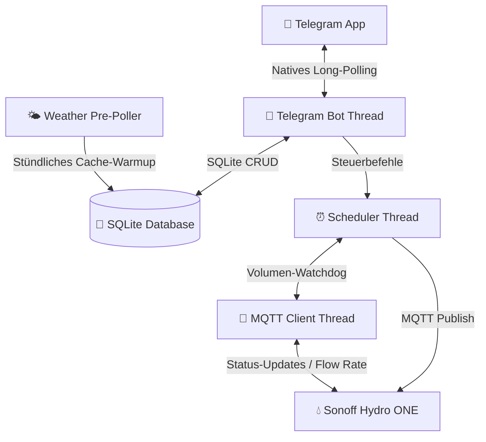

# 💧 Smart Garden Irrigation Daemon (Gartenbewässerungs-Steuerung)

Ein extrem leichtgewichtiger, offline-fähiger und hochsicherer Hintergrunddienst (Daemon) für den **Raspberry Pi Zero W** zur intelligenten Steuerung eines **Sonoff Hydro ONE (Zigbee 3.0)** Wasserventils. 

Die Steuerung erfolgt weltweit gesichert über einen whitelist-basierten **Telegram-Bot** per Long-Polling, wodurch **keine offenen Ports** (Portweiterleitung/NAT-Traversal) an Ihrem Router benötigt werden.

---

## ✨ Hauptmerkmale

*   **🟢 Kombinierter Guss (First-to-Hit Limit):** Ultimativer Überflutungsschutz. Jeder Bewässerungslauf (sowohl manuell als auch geplant) überwacht *parallel* ein **Zeitlimit** (Minuten) und ein **Volumenlimit** (Liter). Das Ventil schließt automatisch, sobald der *erste* Grenzwert erreicht wird (z. B. 50 Liter fließen ODER 15 Minuten verstreichen).
*   **📅 Geführter Zeitplan-Assistent (Guided Wizard):** Erstellen Sie komplexe Zeitpläne Schritt-für-Schritt direkt im Telegram-Chat über intuitive Inline-Tastaturen (freie Namenseingabe, Stundenraster, 5-Minuten-Schritte, Kleingarten-Presets und Multi-Select-Wochentage).
*   **🌦️ Intelligenter Wetter-Skip (Offline-first):** Open-Meteo API-Anbindung prüft stündlich im Hintergrund den Regen (letzte 24h Historie + nächste 24h Vorhersage). Überschreitet die Summe Ihren Grenzwert (z. B. 3.0 mm), wird die geplante Bewässerung übersprungen und protokolliert. Durch lokale SQLite-Zwischenspeicherung funktioniert dies auch bei temporärem Internetausfall.
*   **🔌 Live-Verbindungsanzeige:** Der Status-Bildschirm (`/status`) visualisiert in Echtzeit, ob die MQTT-Brokerverbindung steht (Erkennung von fehlenden USB-Dongles) und wann das physische Ventil das letzte Mal ein Lebenszeichen gesendet hat.
*   **⚡ 100 % Abhängigkeitsfrei (Telegram & API):** Entwickelt komplett auf Basis der Python-Standardbibliotheken (`urllib.request`). Keine schweren Frameworks – perfekt optimiert für den ressourcenschwachen Single-Core-Prozessor des Pi Zero W.

---

## 🛠️ Systemarchitektur & Ablauf

Das System arbeitet vollkommen lokal auf Ihrem Raspberry Pi Zero W:



---

## 📂 Verzeichnisstruktur

```text
/
├── CONTEXT.md               # Projektspezifische Ubiquitous Language (Glossar)
├── README.md                # Diese Dokumentation
├── deploy.ps1               # PowerShell Bereitstellungsskript für Windows
├── setup.sh                 # Automatisches Pi-Installationsskript
├── garden.db                # Lokale SQLite-Datenbank
├── zeitsteuerung_guide.md   # Detaillierter Leitfaden zur Zeitsteuerung
├── docs/
│   └── adr/                 # Architekturentscheidungen (ADRs 0001 - 0008)
├── src/
│   └── daemon/
│       ├── config.py        # Konfigurations- und .env-Loader
│       ├── database.py      # Datenbank-Schnittstelle & automatische Migrationen
│       ├── weather.py       # Wetterdatenabfrage & Skip-Logik
│       ├── mqtt_client.py   # Asynchrone Zigbee2MQTT-Schnittstelle mit Durchfluss-Simulator
│       ├── scheduler.py     # Guss-Zeitsteuerung & parallele Wächter-Threads
│       ├── telegram_bot.py  # Dialogführung, Assistenten & Statusvisualisierung
│       └── main.py          # Zentraler Programmeinstieg
└── tests/
    └── test_irrigation.py   # Unit- & Integrationstests (Offline-Simulationsmodus)
```

---

## 🚀 Installation & Bereitstellung auf dem Pi Zero W

### 1. Voraussetzungen auf dem Raspberry Pi
1. Ein angeschlossener **Zigbee USB-Koordinator** (z. B. *Sonoff Zigbee 3.0 USB Dongle Plus*).
2. Installierter **Mosquitto MQTT Broker** und **Zigbee2MQTT** (das Ventil muss als Friendly Name `garden_valve` gekoppelt sein).
3. Installierte MQTT-Bibliothek für Python:
   ```bash
   pip install paho-mqtt
   ```

### 2. Projektdateien übertragen (Deployment)
Das Projekt enthält ein PowerShell-Skript zur schnellen Übertragung vom Entwicklungs-PC zum Pi:
```powershell
.\deploy.ps1
```
*Geben Sie bei der Abfrage einfach die IP-Adresse (z. B. `192.168.0.165`) und den SSH-Benutzernamen (z. B. `g41nxe`) des Pi ein.*

### 3. Konfiguration einrichten (`.env`)
Erstellen Sie im Projektordner auf dem Pi eine `.env`-Datei:
```bash
cp .env.template .env
nano .env
```
Tragen Sie dort Ihre Zugangsdaten ein:
```ini
TELEGRAM_BOT_TOKEN="DEIN_BOT_TOKEN_VOM_BOTFATHER"
TELEGRAM_ALLOWED_USER_IDS="DEINE_TELEGRAM_USER_ID"
LATITUDE=52.502778
LONGITUDE=13.515556
RAIN_THRESHOLD_MM=3.0
```

### 4. Als systemd-Service einrichten (Autostart & Crash-Resistenz)
Starten Sie das automatisierte Installationsskript auf dem Pi:
```bash
cd ~/garden && bash setup.sh
```
Das Skript richtet die SQLite-Datenbank ein, erstellt den Linux-Systemdienst `garden-irrigation.service` und startet diesen.

Prüfen Sie den Status mit:
```bash
sudo systemctl status garden-irrigation.service
```

---

## 🤖 Bedienung über den Telegram-Bot

Der Bot bietet ein permanentes Tastenmenü am unteren Bildschirmrand:

*   **📊 Status anzeigen (`/status`):** Liefert ein detailliertes Dashboard mit MQTT-Brokerstatus, Ventil-Online-Zustand, aktuellem Guss-Status (Restzeit), Wetterkonditionen (Inkl. Temperatur & Datenstand) und dem Verlauf der letzten Zyklen.
*   **📅 Zeitsteuerung (`/zeitplan`):** Listet alle aktiven Zeitpläne auf und bietet die Schaltfläche **`➕ Neuer Zeitplan`**, um den geführten Assistenten zu starten.
*   **🟢 Bewässern starten:** Startet den zweistufigen manuellen Guss-Assistenten zur bequemen Festlegung von Zeitlimit (Minuten) und Volumenlimit (Liter).
*   **🔴 Sofort Stopp (`/stop`):** Schließt das Ventil unverzüglich und bricht alle aktiven Scheduler- und Volumenwächter-Threads ab.

---

## 🧪 Entwickler & Test-Guide

Sie können das gesamte System lokal (z. B. unter Windows) testen, ohne dass ein physischer USB-Stick oder ein MQTT-Broker angeschlossen sein muss. Der Client wechselt automatisch in einen **Simulationsmodus (Mock-Client)**, falls `paho-mqtt` fehlt oder im Testsuite-Setup `HAS_PAHO = False` gesetzt wird. In diesem Modus wird ein konstanter Wasserdurchfluss von 5 L/Min im Hintergrund simuliert.

**Ausführen der Testsuite:**
```bash
python -m unittest tests/test_irrigation.py
```
*(Die Tests decken Datenbank-CRUD, Migrationslogik, Wetter-Skips, Simulator-Status und die First-to-Hit-Abschaltung ab).*
