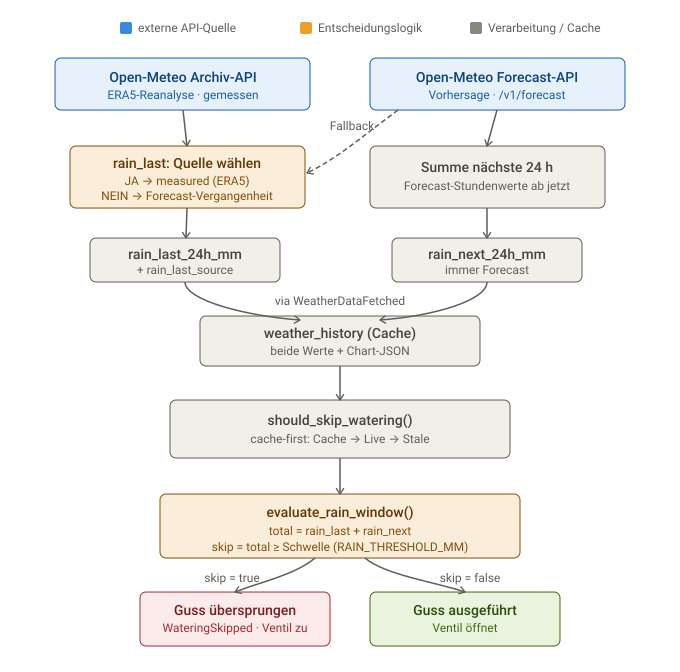

# 24. Gemessene Vergangenheit und Vorhersage getrennt abrufen

Datum: 2026-06-15

## Status

Akzeptiert

## Kontext

Bisher (ADR 0003) wurden der gefallene Regen der letzten 24 Stunden (`rain_last_24h_mm`) und die Vorhersage für die nächsten 24 Stunden (`rain_next_24h_mm`) zusammen aus dem Open-Meteo Forecast-API-Endpunkt (Scheibe von -24h bis +24h) bezogen. Dies führte dazu, dass "gefallener Regen" auf Modell-Vorhersagen der nahen Vergangenheit statt auf echten Messwerten basierte, was in der Realität zu unzuverlässigen Bewässerungsentscheidungen führen konnte.

Zudem gab es das Problem, dass die bisherige Logik in `get_weather_data()` stark davon abhängig war, dass der API-Rückgabewert exakt die aktuelle volle Stunde (Minuten `:00`) enthielt. Andernfalls griff ein hartkodierter Fallback (`current_idx = 24`), was bei API-Änderungen zu fehlerhaften Scheiben führte.

## Entscheidung

Wir entkoppeln die Herkunft der beiden Werte in `get_weather_data()`:
1. **Vergangenheit (`rain_last_24h_mm`)**: Wird fortan primär aus dem Open-Meteo ERA5-Archiv-Endpunkt bezogen (gemessene / Reanalyse-Daten).
2. **Zukunft (`rain_next_24h_mm`)**: Verbleibt beim Open-Meteo Forecast-Modell (best_match).

Sollte der Archiv-Endpunkt nicht erreichbar sein oder keine Daten für die letzte Stunde liefern (z.B. aufgrund von ERA5T-Verzögerungen), degradiert das System automatisch und berechnet den `rain_last`-Wert als Fallback aus der Forecast-Historie.
Zur Nachvollziehbarkeit wird die Herkunft (`"measured"` oder `"forecast"`) als `rain_last_source` durch das gesamte System (Event-Bus, Datenbank, UI-Bericht) gereicht.

Die Zuordnung der aktuellen Stunde erfolgt nun über eine robuste lexikografische Suche des jüngsten Zeitstempels `<= jetzt` (`_find_current_index`), die unabhängig von Minuten-Offsets funktioniert.

## Datenfluss

Das folgende Diagramm zeigt die Herkunft beider Werte bis zur Skip-Entscheidung. Farben kennzeichnen die Herkunft: blau = externe API-Quelle, orange = Entscheidungslogik, grau = interne Verarbeitung/Cache. Es spannt bewusst über die benachbarten Records — Cache-first (ADR 0020) und die pure `evaluate_rain_window` (ADR 0021).

Zu beachten:
- `rain_next_24h_mm` hat **eine** Quelle (Forecast-API, Summe der nächsten 24 h); `rain_last_24h_mm` hat **zwei** mit Priorität (ERA5-Archiv „measured", sonst Forecast-Vergangenheit „forecast"). Die Herkunft steht in `rain_last_source`.
- `should_skip_watering()` liest cache-first aus `weather_history`; bei veraltetem/fehlendem Cache ruft es `get_weather_data()` live auf — das ist exakt der obere Diagrammteil (Quellen → Werte).
- Die Schwelle `RAIN_THRESHOLD_MM` wird über `config.get_setting()` aufgelöst (DB-Override > `.env`/`garden.conf` > Code-Default 2.0).

## Konsequenzen

- Erhöhte Zuverlässigkeit und "Ehrlichkeit" der Regendaten: Wenn messbasierte Daten verfügbar sind, wird die Gießentscheidung basierend auf echten Werten getroffen.
- Fällt das Archiv aus, funktioniert das System ohne Absturz weiter (Graceful Degradation), allerdings wird der Tagesbericht ehrlich darauf hinweisen ("Gemessene Regendaten zurzeit nicht verfügbar").
- Netzwerk-Requests verdoppeln sich beim Wetter-Abruf (Forecast + Archiv), was bei stündlicher Ausführung aber unkritisch ist.
- Referenziert: ADR 0003 (Ursprungsentscheidung), ADR 0020 (Eventbus-Migration).
