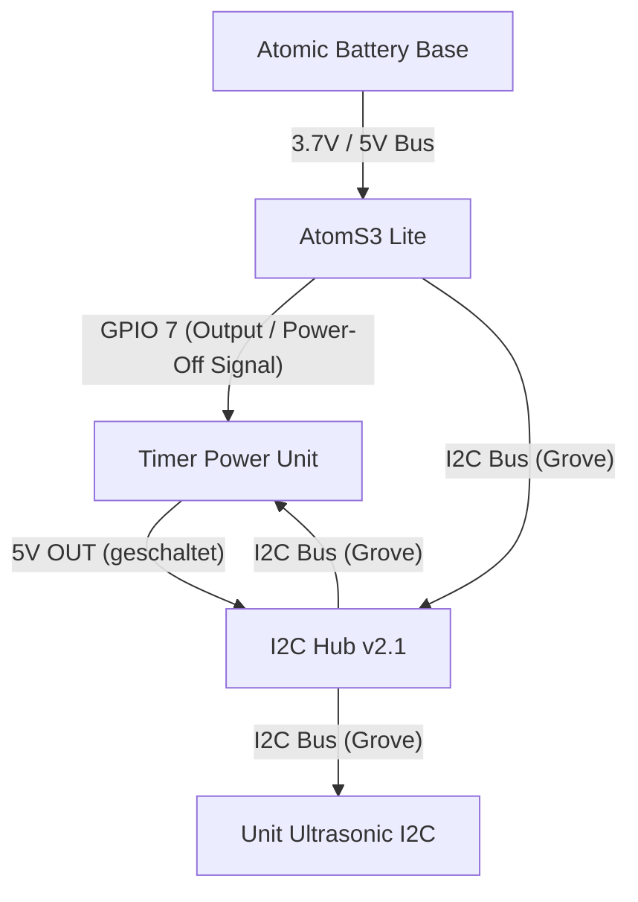

# Hardware-Verkabelung (Schaltplan)

Dieses Dokument beschreibt den physischen Aufbau und die elektrische Verkabelung der Komponenten für den Klärgruben-Füllstandssensor.

## Komponenten
1. **M5Stack AtomS3 Lite** (Microcontroller)
2. **M5Stack Atomic Battery Base** (Stromversorgung / Akku-Base)
3. **M5Stack Timer Power Unit mit OLED** (Timer-gesteuertes Power-Management)
4. **M5Stack I2C Hub 1-to-6 v2.1** (Verteiler für I2C-Geräte)
5. **M5Stack Unit Ultrasonic I2C** (Ultraschall-Distanzsensor)

---

## Verkabelungs-Diagramm

Das folgende Diagramm zeigt den Signal- und Stromfluss zwischen den einzelnen Komponenten.

---

## Detail-Pinbelegung

### 1. Verbindung AtomS3 Lite zu Timer Power Unit & I2C Hub
Da der AtomS3 Lite nur über einen einzigen Grove-Port (I2C) verfügt, wird der **I2C Hub v2.1** zwischengeschaltet.

| Port / Pin (AtomS3 Lite) | Signal-Typ | Ziel-Komponente | Funktion |
| :--- | :--- | :--- | :--- |
| **G2 / SDA** | I2C Data | I2C Hub -> Ultrasonic & Timer Unit | Datenleitung für Sensor und RTC-Timer |
| **G1 / SCL** | I2C Clock | I2C Hub -> Ultrasonic & Timer Unit | Taktleitung für Sensor und RTC-Timer |
| **5V / VCC** | Power | I2C Hub | Spannungsversorgung (geschaltet) |
| **GND** | Ground | I2C Hub | Gemeinsame Masse |
| **G7 (GPIO 7)** | Digital Out | Timer Power Unit (Hold/Wake-Pin) | Signal zur Abschaltung: Wird G7 auf `LOW` gezogen, schaltet die Timer Unit den Strom ab. |

### 2. M5Stack Timer Power Unit
Die Timer Power Unit fungiert als Wächter. Sie enthält eine RTC (Real-Time Clock, typischerweise BM8563), die per I2C konfiguriert wird.
- **Eingang:** Erhält Dauerstrom von der Atomic Battery Base (via USB-C oder PINs).
- **Ausgang:** Versorgt den I2C Hub und darüber den AtomS3 Lite nur dann mit Strom, wenn der Timer abläuft (Aufwachen) oder der manuelle Wake-Button gedrückt wird.
- **Hold-Pin:** Liest den Zustand von GPIO 7 des AtomS3 Lite. Sobald dieser Pin auf `LOW` gesetzt wird, schaltet sich die Unit ab.

---

## Gehäuse- & Einbauhinweise

> [!WARNING]
> **Korrosionsschutz in der Klärgrube:**
> Die Umgebung in einer Klärgrube ist extrem feucht und enthält korrosive Gase (z. B. Schwefelwasserstoff). 
> - Die Elektronik (AtomS3 Lite, Hub, Timer Power Unit) muss in ein **wasserdichtes IP68-Gehäuse** außerhalb der Grube oder im oberen, trockenen Bereich verbaut werden.
> - Der Ultraschallsensor selbst sollte durch eine kleine Gummidichtung geschützt oder ein wasserdichter Ultraschallsensor (z.B. M5Stack Unit Ultrasonic Waterproof) verwendet werden, falls die Gefahr von direktem Kondenswasser besteht.
